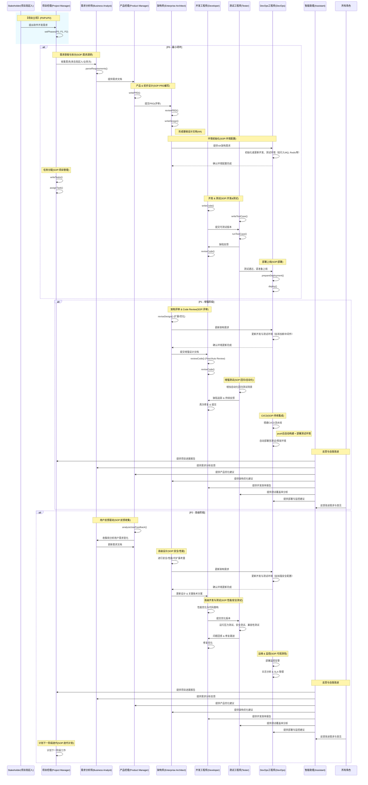

# AICO-Meta：基于多智能体的企业级软件研发框架

## 1. AICO-Meta 的定位

- **AICO-Meta** 并不是一个需要开发的具体业务系统，而是一个 **"多智能体协同" 的研发框架**。  
- 通过为各个关键角色（项目经理、需求分析师、产品经理、架构师、开发、测试、DevOps 等）配置 **SOP**（标准作业流程），以及利用 **LLM（大模型）** 来支撑角色的智能化决策或输出，可以加速并规范企业级软件开发项目。

在这个框架中，各角色并不一定都是真人，也可以是由 **MetaGPT** 驱动的多智能体，或"人+Agent"协同。团队可灵活配置流程颗粒度、角色数量、以及自动化程度。

---

## 2. 分阶段实现规划 (P0 / P1 / P2)

典型地，我们将 AICO-Meta 的落地过程分为三个阶段，以逐步构建和完善能力：

1. **P0：最小可用闭环**  
   - 搭建基础角色（PM、BA、PDM、EA、DEV、QA、DO），实现从需求到上线的最小流程。  
   - 目标：能够完成一次简单的软件交付，包括需求撰写、设计、编码、测试和部署的关键路径。  
2. **P1：增强阶段**  
   - 在 P0 的基础上，引入更完整的自动化评审流程（如自动 Code Review、自动化回归测试），以及初步的 CI/CD 管线。  
   - 目标：提高研发效率和质量，减少人工重复性操作，通过增强 SOP 让每个角色的智能体更具协同能力。  
3. **P2：高级阶段**  
   - 加入更多高级功能，如用户反馈分析、复杂性能/安全测试、监控告警和数据分析等，走向真正的"生产级"可观测、可扩展架构。  
   - 目标：打造大中型企业可用的软件交付体系，包括运维与持续演进，支撑更复杂的业务场景。

---

## 3. 角色与关键能力：分阶段说明

下表列出了常见的企业软件研发角色及其核心业务能力，并标示了**在哪个阶段至少需要实现**这些能力。随着项目规模和复杂度的扩大，可以进一步细化这些角色，或者在小型项目中做部分角色合并。

| 角色名称 | 核心业务能力 (Key Abilities) | 分阶段实现 (P0/P1/P2) | 对应的 MetaGPT 实现参考 |
|------------------------------|-------------------------------------------------------------------------------------------------------------------------------------------------------------------------------------------------------------------------------------------------------------------------------------------------------|--------------------------------------------------------------------|---------------------------------------------------------------------------------------------------------------------------------------------------|
| 项目经理 (Project Manager, PM) | - setPhases() - reflect() 定期复盘项目进展 - retrieve() 检索历史经验 - writeTasks(), assignTask() - 负责项目进度、协调资源、风险管理 | P0：初始化项目阶段设置 P1：加强计划与资源调度 P2：多项目/多团队管理 | st_role.py |
| 需求分析师 (Business Analyst, BA) | - parseRequirements() - reflect() 反思需求 - 负责需求调研与业务分析，输出需求说明文档 | P0：基础需求调研 P1：持续与用户/业务方沟通 P2：复杂业务建模、竞争分析 | st_role.py |
| 产品经理 (Product Manager, PDM) | - writePRD(), revisePRD() - analyzeUserFeedback() - 输出或修订产品需求文档（PRD），定义验收标准 - run_reflect() 反思和优化 | P0：编写初版 PRD P1：多轮迭代 P2：用户反馈驱动产品优化 | st_role.py |
| 架构师 (Enterprise Architect, EA) | - reviewPRD(), writeDesign(), reviseDesign() - reviewCode() 参与关键代码评审 - 输出架构设计文档 (4A：应用/数据/技术/安全) | P0：基础架构设计 P1：评审流程完善 P2：性能、安全、可扩展等高级需求 | st_role.py |
| 开发工程师 (Developer, DEV) | - writeCode(), run_code(), reviewCode(), reviseCode() - debug_reflection() 代码调试与优化 - 输出可运行代码，修复缺陷 | P0：编写核心功能 P1：参与 Review、自动化单测 P2：性能优化、持续重构 | run_code.py mock.py |
| 测试工程师 (Tester, QA) | - writeTestCase(), runTestCase() - 增加自动化回归测试场景 - 根据需求和设计文档编写/执行测试用例 | P0：功能测试 P1：自动化测试/回归测试 P2：性能、安全、兼容测试 | reflect.py |
| DevOps工程师 (DevOps Engineer, DO) | - 根据架构调整，初始化或更新开发环境、测试环境等 - env_api_registry 环境 API 注册 - prepareDeployment(), deploy() - observe() 系统监控与日志分析 - 搭建 CI/CD 流水线 - 部署监控告警 | P0：初始化基础开发与测试环境 P1：实现 CI/CD 与环境自动化更新 P2：监控告警、容器化、可观测性 | environment/README.md |
| 数据科学家 (Data Scientist, DS) | - analyzeData(), writeAnalysisCode() - 数据分析与建模 - 生成数据报告 | P1：引入数据分析工具 P2：复杂数据建模与分析 | write_analysis_code.py |
| 智能助理 (Assistant) | - 反思与自我改进 - 上下文记忆能力 - 语义理解与技能调用 | P1：集成智能助理 P2：多模态输入与自我学习能力 | assistant.py |

> **说明：**  
> - 在 **P0**（最小可用闭环）时，每个角色只需具备最基础的能力即可完成一次功能上线。  
> - 到了 **P1**，在 P0 的基础上增强各角色协同与自动化程度。  
> - **P2** 面向更复杂或大规模场景，需要引入更多高级能力（安全、性能、可观测性、用户反馈闭环等）。

---

## 4. 分阶段协同时序图（详细版示例）

下面的 Mermaid 时序图分块展示了 **P0**（最小闭环）、**P1**（增强阶段）和 **P2**（高级阶段）中的关键角色交互。每个阶段都有相应的 **SOP** 要求、输入/输出文档依赖等示例注释。您可以根据实际项目需求做进一步精简或扩展。

---

## 5. 关键结论

1. **AICO-Meta** 是一个用于企业级软件研发的多智能体协作框架，而非具体业务系统本身。  
2. 可根据项目实际规模和预算，逐步从 **P0**（基础闭环）到 **P1**（增强自动化）再到 **P2**（高级可观测、可扩展）进行落地。  
3. 每个角色的 **SOP**（标准作业流程）都由**所需输入文档、产出结果、评审流程**构成；配合 **LLM / Agent** 的能力，可实现**自动或半自动**的需求分析、PRD 编写、架构设计、代码开发、测试、部署等。  
4. **时序图**中详细展示了在各阶段，各角色如何互相依赖和传递文档(需求文档、PRD、Design、测试用例等)，体现了从立项到上线的完整路径。  
5. 当团队引入 **AICO-Meta**，既可在小型项目中快速启动(只要具备 P0 能力)，也可在中大型项目中逐步扩展至 P1/P2，更好地满足**企业研发流程的深度与广度**需求。

---

### 进一步扩展

- **角色可合并或拆分**：在小型项目中，PM/BA/PDM 可能由同一人或同一 Agent 兼任；大型项目中，则可能增加更多细分角色（如安全专家、数据分析师、UI/UX 设计师等）。  
- **工具与环境**：搭配 Git、CI/CD、自动化测试平台、项目管理工具（如 Jira/Confluence 等）或企业内部 DevOps 平台，形成更完善的一体化流程。  
- **人机协同**：在高风险或关键决策点（如架构大变动、安全合规要求）保持人工签字或审批机制，兼顾效率与安全。

# 附：P0阶段各个角色标准的标准作业流程 (SOP)

在**P0：最小可用闭环**阶段，各个角色需要具备最基础的能力，以完成一次完整的软件交付流程。以下是各角色在P0阶段的标准作业流程：

## 1. 项目经理 (Project Manager, PM)

### 主要职责
- 负责项目的整体规划与管理，确保项目按时、按质、按预算完成。
- 协调各角色之间的工作，解决项目执行过程中遇到的问题。

### 标准作业流程
1. **项目立项**
   - 与项目发起人沟通，明确项目需求和目标。
   - 制定项目计划，设定项目阶段 (P0)。
   
2. **任务分配**
   - 根据项目需求，创建任务列表。
   - 将任务分配给相应的角色（BA、PDM、EA、DEV、QA、DO）。
   
3. **进度跟踪**
   - 定期检查项目进展，确保各项任务按时完成。
   - 记录项目进度，识别和管理风险。

4. **资源协调**
   - 确保各角色拥有完成任务所需的资源和支持。
   - 解决项目执行过程中出现的资源冲突或不足问题。

5. **沟通管理**
   - 组织定期的项目会议，汇报进展并讨论问题。
   - 与利益相关者保持沟通，确保他们了解项目状态。

## 2. 需求分析师 (Business Analyst, BA)

### 主要职责
- 负责需求的调研与分析，确保项目需求明确且可执行。
- 编写需求说明文档，为后续的设计和开发提供依据。

### 标准作业流程
1. **需求调研**
   - 与项目发起人及业务方沟通，收集软件需求。
   - 分析业务流程，识别关键需求点。

2. **需求解析**
   - 使用 `parseRequirements()` 方法解析收集到的需求。
   - 确保需求的完整性和一致性，消除潜在的需求冲突。

3. **需求文档编写**
   - 编写详细的需求说明文档 (`Requirements Document`)。
   - 将需求文档提交给产品经理和架构师进行审阅。

4. **需求确认**
   - 根据反馈修订需求文档，确保所有需求得到确认和认可。

## 3. 产品经理 (Product Manager, PDM)

### 主要职责
- 定义产品需求，编写和维护产品需求文档（PRD）。
- 确保产品功能符合用户需求和市场定位。

### 标准作业流程
1. **编写PRD**
   - 根据BA提供的需求文档，编写初版产品需求文档 (`writePRD()`)。
   - 明确产品功能、用户故事和验收标准。

2. **PRD评审**
   - 将PRD提交给架构师进行评审，确保技术可行性。
   - 根据评审意见修订PRD，完善产品需求。

3. **产品需求确认**
   - 与利益相关者确认最终版本的PRD，确保所有需求得到认可。

## 4. 架构师 (Enterprise Architect, EA)

### 主要职责
- 设计系统架构，确保软件的可扩展性、性能和安全性。
- 参与关键代码评审，保证代码质量。

### 标准作业流程
1. **PRD评审**
   - 审查产品需求文档 (`reviewPRD()`) ，确保需求的技术可行性。
   
2. **架构设计**
   - 基于PRD，编写系统架构设计文档 (`writeDesign()`)。
   - 确定系统的4A架构（应用、数据、技术、安全）。

3. **设计审查**
   - 将架构设计文档提交给相关角色审查，收集反馈意见。
   - 修订设计文档，确保架构满足项目需求。

## 5. 开发工程师 (Developer, DEV)

### 主要职责
- 负责软件的编码和实现，确保功能符合需求和设计。
- 修复缺陷，优化代码质量。

### 标准作业流程
1. **编写代码**
   - 根据PRD和架构设计文档，编写核心功能代码 (`writeCode()`)。
   
2. **代码提交**
   - 将编写的代码提交至版本控制系统，并确保代码可编译运行 (`run_code()`)。
   
3. **自检与互检**
   - 进行自检代码 (`reviewCode()`)，确保代码质量。
   - 如有需要，与其他开发工程师进行代码互检。

4. **缺陷修复**
   - 根据测试工程师提交的缺陷报告，修复代码中的问题 (`reviseCode()`)。
   
5. **提交可测试版本**
   - 将修复后的代码提交给测试工程师进行测试。

## 6. 测试工程师 (Tester, QA)

### 主要职责
- 负责编写和执行测试用例，确保软件功能符合需求。
- 发现并报告软件缺陷，确保软件质量。

### 标准作业流程
1. **编写测试用例**
   - 根据PRD和设计文档，编写详细的测试用例 (`writeTestCase()`)。
   
2. **执行测试**
   - 运行编写的测试用例，验证软件功能是否符合预期 (`runTestCase()`)。
   
3. **缺陷报告**
   - 记录发现的缺陷，编写缺陷报告并提交给开发工程师 (`缺陷报告、测试报告`)。
   
4. **回归测试**
   - 在开发工程师修复缺陷后，重新执行相关测试用例，确保缺陷已被修复。

## 7. DevOps工程师 (DevOps Engineer, DO)

### 主要职责
- 负责开发和测试环境的初始化与维护，确保环境配置正确。
- 负责软件的部署，确保软件能够顺利上线。

### 标准作业流程
1. **环境配置**
   - 根据架构设计文档，初始化或更新开发环境和测试环境（如引入MQ、Redis等）。
   
2. **环境确认**
   - 确保开发和测试环境配置完成，并与架构师确认环境设置无误。

3. **部署准备**
   - 在测试通过后，准备部署上线所需的步骤 (`prepareDeployment()`)。
   
4. **软件部署**
   - 将经过测试的软件部署到生产环境 (`deploy()`)。
   
5. **部署验证**
   - 确认部署成功，监控部署日志，确保系统正常运行。

