# AICO-Meta：基于多智能体的企业级软件研发框架

## 1. AICO-Meta 的定位

- **AICO-Meta** 并不是一个需要开发的具体业务系统，而是一个 **"多智能体协同" 的研发框架**。
- 通过为各个关键角色（项目经理、需求分析师、产品经理、架构师、开发、测试、DevOps 等）配置 **SOP**（标准作业流程），以及利用 **LLM（大模型）** 来支撑角色的智能化决策或输出，可以加速并规范企业级软件开发项目。

在这个框架中，各角色并不一定都是真人，也可以是由 **MetaGPT** 驱动的多智能体，或"人+Agent"协同。团队可灵活配置流程颗粒度、角色数量、以及自动化程度。

---

## 2. 分阶段实现规划 (P0 / P1 / P2)

典型地，我们将 AICO-Meta 的落地过程分为三个阶段，以逐步构建和完善能力：

1. **P0：最小可用闭环**
   - 搭建基础角色（BA、PDM、EA、DEV、QA、DO），实现从需求到上线的最小流程。
   - 目标：用户输入相应的业务需求和技术需求后，可以完整生成一个最小可运行的项目，包括需求撰写、设计、编码、测试和部署的关键路径。
2. **P1：增强阶段**
   - 在 P0 的基础上，引入项目管理能力（如项目阶段设置 `setPhases()`）、更完整的自动化评审流程（如自动 Code Review、自动化回归测试），以及初步的 CI/CD 管线。
   - 目标：提高研发效率和质量，减少人工重复性操作，通过增强 SOP 让每个角色的智能体更具协同能力。
3. **P2：高级阶段**
   - 加入更多高级功能，如用户反馈分析、复杂性能/安全测试、监控告警和数据分析等，走向真正的"生产级"可观测、可扩展架构。
   - 目标：打造大中型企业可用的软件交付体系，包括运维与持续演进，支撑更复杂的业务场景。

---

## 3. 角色与关键能力：分阶段说明

下表列出了常见的企业软件研发角色及其核心业务能力，并标示了**在哪个阶段至少需要实现**这些能力。随着项目规模和复杂度的扩大，可以进一步细化这些角色，或者在小型项目中做部分角色合并。

| 角色名称                               | 核心业务能力 (Key Abilities)                                                                                                                                                                       | 分阶段实现 (P0/P1/P2)                                                                             | 对应的 MetaGPT 实现参考 |
| -------------------------------------- | -------------------------------------------------------------------------------------------------------------------------------------------------------------------------------------------------- | ------------------------------------------------------------------------------------------------- | ----------------------- |
| 项目经理 (Project Manager, PM)      | - reflect() 定期复盘项目进展 - retrieve() 检索历史经验 - writeTasks(), assignTask() - 负责项目进度、协调资源、风险管理                                                                    | P1：初始化项目阶段设置 P2：多项目/多团队管理                                                   | st_role.py              |
| 需求分析师 (Business Analyst, BA)   | - parseRequirements() - reflect() 反思需求 - 负责需求调研与业务分析，输出需求说明文档                                                                                                        | P0：基础需求调研 P1：持续与用户/业务方沟通 P2：复杂业务建模、竞争分析                       | st_role.py              |
| 产品经理 (Product Manager, PDM)     | - writePRD(), revisePRD() - analyzeUserFeedback() - 输出或修订产品需求文档（PRD），定义验收标准 - run_reflect() 反思和优化                                                                | P0：编写初版 PRD P1：多轮迭代 P2：用户反馈驱动产品优化                                      | st_role.py              |
| 架构师 (Enterprise Architect, EA)   | - reviewPRD(), writeDesign(), reviseDesign() - reviewCode() 参与关键代码评审 - 输出架构设计文档 (4A：应用/数据/技术/安全) - **conduct4AAssessment() 进行 4A 架构评估**                    | P0：基础架构设计 P1：评审流程完善 P2：性能、安全、可扩展等高级需求                          | st_role.py              |
| 开发工程师 (Developer, DEV)         | - writeCode(), run_code(), reviewCode(), reviseCode() - debug_reflection() 代码调试与优化 - 输出可运行代码，修复缺陷                                                                         | P0：编写核心功能 P1：参与 Review、自动化单测 P2：性能优化、持续重构                         | run_code.py mock.py  |
| 测试工程师 (Tester, QA)             | - writeTestCase(), runTestCase() - 增加自动化回归测试场景 - 根据需求和设计文档编写/执行测试用例                                                                                              | P0：功能测试 P1：自动化测试/回归测试 P2：性能、安全、兼容测试                               | reflect.py              |
| DevOps 工程师 (DevOps Engineer, DO) | - 根据架构调整，初始化或更新开发环境、测试环境等 - env_api_registry 环境 API 注册 - prepareDeployment(), deploy() - observe() 系统监控与日志分析 - 搭建 CI/CD 流水线 - 部署监控告警 | P0：初始化基础开发与测试环境 P1：实现 CI/CD 与环境自动化更新 P2：监控告警、容器化、可观测性 | environment/README.md   |
| 数据科学家 (Data Scientist, DS)     | - analyzeData(), writeAnalysisCode() - 数据分析与建模 - 生成数据报告                                                                                                                         | P1：引入数据分析工具 P2：复杂数据建模与分析                                                    | write_analysis_code.py  |
| 智能助理 (Assistant)                | - 反思与自我改进 - 上下文记忆能力 - 语义理解与技能调用                                                                                                                                       | P1：集成智能助理 P2：多模态输入与自我学习能力                                                  | assistant.py            |

> **说明：**
>
> - 在 **P0**（最小可用闭环）时，每个角色只需具备最基础的能力即可完成一次功能上线。
> - 到了 **P1**，在 P0 的基础上增强各角色协同与自动化程度。
> - **P2** 面向更复杂或大规模场景，需要引入更多高级能力（安全、性能、可观测性、用户反馈闭环等）。

---

## 4. 分阶段协同时序图（详细版示例）

下面的 Mermaid 时序图分块展示了 **P0**（最小闭环）、**P1**（增强阶段）和 **P2**（高级阶段）中的关键角色交互。每个阶段都有相应的 **SOP** 要求、输入/输出文档依赖等示例注释。您可以根据实际项目需求做进一步精简或扩展。

```mermaid
sequenceDiagram
    participant SYS as Stakeholder(项目发起人)
    participant PM as 项目经理(Project Manager)
    participant BA as 需求分析师(Business Analyst)
    participant PDM as 产品经理(Product Manager)
    participant EA as 架构师(Enterprise Architect)
    participant DEV as 开发工程师(Developer)
    participant QA as 测试工程师(Tester)
    participant DO as DevOps工程师(DevOps)
    participant AS as 智能助理(Assistant)

    rect rgb(235, 250, 255)
        note over SYS,PM: 【项目立项】(P0/P1/P2)
        SYS->>PM: 提出软件开发需求
    end

    alt P0 - 最小闭环
        note over BA,BA: 需求获取与拆分(SOP:需求调研)
        PM->>BA: 收集需求(来自发起人/业务方)
        BA->>BA: parseRequirements()
        BA->>PDM: 提供需求文档
        PDM->>PDM: writePRD()
        PDM->>EA: 提交PRD进行评审

        note over EA,BA: 4A架构需求调研与PRD评审
        EA->>EA: reviewPRD()
        EA->>EA: conduct4AAssessment()
        EA->>EA: writeDesign() / reviseDesign()
        EA->>DO: 提供4A架构需求
        DO->>DO: 初始化或更新开发、测试环境（如引入MQ, Redis等）
        DO-->>EA: 确认环境配置完成
        EA->>PM: 通知环境配置完成

        note over PDM,EA: 产品 & 初步设计(SOP:PRD编写)
        note right of EA: 形成基础设计文档(4A)

        note over PM: 任务分配(SOP:项目管理)
        PM->>PM: writeTasks()
        PM->>PM: assignTask()
        PM->>DEV: 分配开发任务
        DEV-->>PM: 确认接收任务
        PM->>QA: 分配测试任务
        QA-->>PM: 确认接收任务

        note over DEV,QA: 开发 & 测试(SOP:开发&测试)
        DEV->>DEV: writeCode()
        QA->>QA: writeTestCase()
        DEV->>QA: 提交可测试版本
        QA->>QA: runTestCase()
        QA->>DEV: 缺陷反馈
        DEV->>DEV: reviseCode()
        DEV->>QA: 提交修复版本
        QA->>QA: 验证测试
        QA->>PM: 报告测试结果

        note over DO: 部署上线(SOP:部署)
        PM->>DO: 授权部署上线
        DO->>DO: prepareDeployment()
        DO->>DO: deploy()
        DO-->>PM: 报告部署完成
        PM->>SYS: 通知功能上线完成
    end

    alt P1 - 增强阶段
        note over PM: 项目管理能力增强(SOP:项目阶段设置)
        PM->>PM: setPhases(P1, P2)

        note over EA,DEV: 架构评审 & Code Review(SOP:评审)
        EA->>EA: reviseDesign() (扩展/优化)
        EA->>DO: 更新架构需求
        DO->>DO: 更新开发与测试环境（如添加新中间件）
        DO-->>EA: 确认环境更新完成
        EA->>PM: 通知环境更新完成
        EA->>DEV: 提交增强设计文档
        DEV-->>EA: 确认收到设计文档
        DEV->>DEV: reviewCode() (Peer/Auto Review)
        DEV->>DEV: reviseCode()

        note over QA: 增强测试(SOP:回归/自动化)
        QA->>QA: 增加自动化回归测试场景
        QA->>DEV: 缺陷追踪 & 持续反馈
        DEV->>DEV: 再次修复 & 提交
        DEV->>QA: 提交修复结果
        QA->>PM: 报告测试进展

        note over DO: CI/CD(SOP:持续集成)
        PM->>DO: 授权部署更新
        DO->>DO: 搭建CI/CD流水线
        note right of DO: push后自动构建 + 部署测试环境
        DO->>DO: 自动部署至测试/预发环境
        DO-->>PM: 报告部署状态

        note over AS,所有角色: 反思与自我改进
        AS->>PM: 提供项目进展报告
        AS->>BA: 提供需求分析反馈
        AS->>PDM: 提供产品优化建议
        AS->>EA: 提供架构优化建议
        AS->>DEV: 提供开发效率报告
        AS->>QA: 提供测试覆盖率分析
        AS->>DO: 提供部署与监控建议
        所有角色->>AS: 反馈改进需求与意见
    end

    alt P2 - 高级阶段
        note over PDM,BA: 用户反馈驱动(SOP:反馈收集)
        PDM->>PDM: analyzeUserFeedback()
        PDM->>BA: 收集和分析用户需求变化
        BA->>PDM: 更新需求文档
        PDM->>PM: 提交需求变更

        note over EA: 高级设计(SOP:安全/性能)
        EA->>EA: conduct4AAssessment()
        EA->>EA: reviseDesign() (基于4A评估)
        EA->>DO: 更新架构需求
        DO->>DO: 更新开发与测试环境（如加强安全配置）
        DO-->>EA: 确认环境更新完成
        EA->>PM: 通知环境更新完成
        EA->>DEV: 更新设计 & 关键技术方案
        DEV-->>EA: 确认收到方案

        note over DEV,QA: 高级开发与测试(SOP:性能/安全测试)
        DEV->>DEV: 性能优化与代码重构
        DEV->>QA: 提交优化版本
        QA->>QA: 运行压力测试、安全测试、兼容性测试
        QA->>DEV: 问题回馈 & 修复跟进
        DEV->>DEV: 修复优化
        DEV->>QA: 提交修复版本
        QA->>PM: 报告测试结果

        note over DO: 运维与监控(SOP:可观测性)
        PM->>DO: 授权部署监控系统
        DO->>DO: 部署监控告警
        DO->>DO: 日志分析 & SLA 管理
        DO-->>PM: 报告监控系统状态

        note over AS,所有角色: 反思与自我改进
        AS->>PM: 提供项目进展报告
        AS->>BA: 提供需求分析反馈
        AS->>PDM: 提供产品优化建议
        AS->>EA: 提供架构优化建议
        AS->>DEV: 提供开发效率报告
        AS->>QA: 提供测试覆盖率分析
        AS->>DO: 提供部署与监控建议
        所有角色->>AS: 反馈改进需求与意见

        note over PM: 计划下一阶段迭代(SOP:迭代计划)
        PM->>PM: 计划下一阶段工作
        PM->>所有角色: 分发迭代计划
    end

    note over SYS,EA: 【4A 架构需求调研】
    SYS->>EA: 提供业务和技术需求
    EA->>EA: conduct4AAssessment()
    EA->>SYS: 反馈架构设计建议
```

---

## 5. 关键结论

1. **AICO-Meta** 是一个用于企业级软件研发的多智能体协作框架，而非具体业务系统本身。
2. 可根据项目实际规模和预算，逐步从 **P0**（基础闭环）到 **P1**（增强自动化）再到 **P2**（高级可观测、可扩展）进行落地。
3. 每个角色的 **SOP**（标准作业流程）都由**所需输入文档、产出结果、评审流程**构成；配合 **LLM / Agent** 的能力，可实现**自动或半自动**的需求分析、PRD 编写、架构设计、代码开发、测试、部署等。
4. **时序图**中详细展示了在各阶段，各角色如何互相依赖和传递文档(需求文档、PRD、Design、测试用例等)，体现了从立项到上线的完整路径。
5. 当团队引入 **AICO-Meta**，既可在小型项目中快速启动(只要具备 P0 能力)，也可在中大型项目中逐步扩展至 P1/P2，更好地满足**企业研发流程的深度与广度**需求。

---

### 进一步扩展

- **角色可合并或拆分**：在小型项目中，PM/BA/PDM 可能由同一人或同一 Agent 兼任；大型项目中，则可能增加更多细分角色（如安全专家、数据分析师、UI/UX 设计师等）。
- **工具与环境**：搭配 Git、CI/CD、自动化测试平台、项目管理工具（如 Jira/Confluence 等）或企业内部 DevOps 平台，形成更完善的一体化流程。
- **人机协同**：在高风险或关键决策点（如架构大变动、安全合规要求）保持人工签字或审批机制，兼顾效率与安全。

# 附：P0 阶段各个角色标准的标准作业流程 (SOP)

在**P0：最小可用闭环**阶段，各个角色需要具备最基础的能力，以完成一次完整的软件交付流程。以下是各角色在 P0 阶段的标准作业流程：

## 1. 项目经理 (Project Manager, PM)

### 主要职责

- 负责项目的整体规划与管理，确保项目按时、按质、按预算完成。
- 协调各角色之间的工作，解决项目执行过程中遇到的问题。

### 标准作业流程

1. **项目立项**
   - 与项目发起人沟通，明确项目需求和目标。
   - 制定项目计划，设定项目阶段 (P0)。
2. **任务分配**
   - 根据项目需求，创建任务列表。
   - 将任务分配给相应的角色（BA、PDM、EA、DEV、QA、DO）。
3. **进度跟踪**
   - 定期检查项目进展，确保各项任务按时完成。
   - 记录项目进度，识别和管理风险。
4. **资源协调**
   - 确保各角色拥有完成任务所需的资源和支持。
   - 解决项目执行过程中出现的资源冲突或不足问题。
5. **沟通管理**
   - 组织定期的项目会议，汇报进展并讨论问题。
   - 与利益相关者保持沟通，确保他们了解项目状态。

## 2. 需求分析师 (Business Analyst, BA)

### 主要职责

- 负责需求的调研与分析，确保项目需求明确且可执行。
- 编写需求说明文档，为后续的设计和开发提供依据。

### 标准作业流程

1. **需求调研**
   - 与项目发起人及业务方沟通，收集软件需求。
   - 分析业务流程，识别关键需求点。
2. **需求解析**
   - 使用 `parseRequirements()` 方法解析收集到的需求。
   - 确保需求的完整性和一致性，消除潜在的需求冲突。
3. **需求文档编写**
   - 编写详细的需求说明文档 (`Requirements Document`)。
   - 将需求文档提交给产品经理和架构师进行审阅。
4. **需求确认**
   - 根据反馈修订需求文档，确保所有需求得到确认和认可。

## 3. 产品经理 (Product Manager, PDM)

### 主要职责

- 定义产品需求，编写和维护产品需求文档（PRD）。
- 确保产品功能符合用户需求和市场定位。

### 标准作业流程

1. **编写 PRD**
   - 根据 BA 提供的需求文档，编写初版产品需求文档 (`writePRD()`)。
   - 明确产品功能、用户故事和验收标准。
2. **PRD 评审**
   - 将 PRD 提交给架构师进行评审，确保技术可行性。
   - 根据评审意见修订 PRD，完善产品需求。
3. **产品需求确认**
   - 与利益相关者确认最终版本的 PRD，确保所有需求得到认可。

## 4. 架构师 (Enterprise Architect, EA)

### 主要职责

- 设计系统架构，确保软件的可扩展性、性能和安全性。
- 参与关键代码评审，保证代码质量。
- **进行客户的 4A 架构需求调研**

### 标准作业流程

1. **需求调研与 PRD 评审**
   - **提交与评审 PRD**：
     - 产品经理 (PDM) 提交 PRD 进行评审。
     - 架构师 (EA) 审查 PRD (`reviewPRD()`)，确保需求的技术可行性。
   - **4A 架构需求调研**：
     - **应用层（Application）**：与客户沟通，了解业务流程和功能需求，确保架构能够支持业务扩展。
     - **数据层（Data）**：收集和分析客户的数据管理需求，包括数据存储、处理和分析的要求。
     - **技术层（Technology）**：评估客户现有的技术栈和未来的技术发展方向，确保架构设计的技术可行性和前瞻性。
     - **安全层（Security）**：了解客户的安全规范和合规要求，确保架构设计能够满足安全性和隐私保护的需求。
   - **设计文档编写**：
     - 根据 PRD 和 4A 评估结果，编写系统架构设计文档 (`writeDesign()`) 或修订现有设计文档 (`reviseDesign()`）。
2. **设计审查**
   - 将架构设计文档提交给相关角色审查，收集反馈意见。
   - 修订设计文档，确保架构满足项目需求和客户的 4A 需求。

## 5. 开发工程师 (Developer, DEV)

### 主要职责

- 负责软件的编码和实现，确保功能符合需求和设计。
- 修复缺陷，优化代码质量。

### 标准作业流程

1. **编写代码**
   - 根据 PRD 和架构设计文档，编写核心功能代码 (`writeCode()`)。
2. **代码提交**
   - 将编写的代码提交至版本控制系统，并确保代码可编译运行 (`run_code()`)。
3. **自检与互检**
   - 进行自检代码 (`reviewCode()`)，确保代码质量。
   - 如有需要，与其他开发工程师进行代码互检。
4. **缺陷修复**
   - 根据测试工程师提交的缺陷报告，修复代码中的问题 (`reviseCode()`)。
5. **提交可测试版本**
   - 将修复后的代码提交给测试工程师进行测试。

## 6. 测试工程师 (Tester, QA)

### 主要职责

- 负责编写和执行测试用例，确保软件功能符合需求。
- 发现并报告软件缺陷，确保软件质量。

### 标准作业流程

1. **编写测试用例**
   - 根据 PRD 和设计文档，编写详细的测试用例 (`writeTestCase()`)。
2. **执行测试**
   - 运行编写的测试用例，验证软件功能是否符合预期 (`runTestCase()`)。
3. **缺陷报告**
   - 记录发现的缺陷，编写缺陷报告并提交给开发工程师 (`缺陷报告、测试报告`)。
4. **回归测试**
   - 在开发工程师修复缺陷后，重新执行相关测试用例，确保缺陷已被修复。

## 7. DevOps 工程师 (DevOps Engineer, DO)

### 主要职责

- 负责开发和测试环境的初始化与维护，确保环境配置正确。
- 负责软件的部署，确保软件能够顺利上线。

### 标准作业流程

1. **环境配置**
   - 根据架构设计文档，初始化或更新开发环境和测试环境（如引入 MQ、Redis 等）。
2. **环境确认**
   - 确保开发和测试环境配置完成，并与架构师确认环境设置无误。
3. **部署准备**
   - 在测试通过后，准备部署上线所需的步骤 (`prepareDeployment()`)。
4. **软件部署**
   - 将经过测试的软件部署到生产环境 (`deploy()`)。
5. **部署验证**
   - 确认部署成功，监控部署日志，确保系统正常运行。

# AICO-Meta 基于 MetaGPT 的实现清单

## P0 阶段（最小可用闭环）任务

### 1. 核心角色实现

- [ ] **项目经理 (PM)**
  - [ ] 实现 `writeTasks()`, `assignTask()` 方法
  - [ ] 扩展 MetaGPT 的 `st_role.py`，增加项目管理相关能力
- [ ] **需求分析师 (BA)**
  - [ ] 实现 `parseRequirements()` 方法
  - [ ] 扩展 MetaGPT 的需求分析能力
  - [ ] 增加需求文档生成模板
- [ ] **产品经理 (PDM)**
  - [ ] 实现 `writePRD()`, `revisePRD()` 方法
  - [ ] 定义标准 PRD 模板
  - [ ] 扩展 MetaGPT 的产品需求文档生成能力
- [ ] **架构师 (EA)**
  - [ ] 实现 `reviewPRD()`, `writeDesign()`, `reviseDesign()` 方法
  - [ ] 实现 `conduct4AAssessment()` 方法，支持 4A 架构评估
  - [ ] 定义架构设计文档模板（包含 4A 维度）
- [ ] **开发工程师 (DEV)**
  - [ ] 扩展 MetaGPT 的 `run_code.py`，增强代码生成能力
  - [ ] 实现 `writeCode()`, `reviewCode()`, `reviseCode()` 方法
  - [ ] 增加代码调试与优化能力
- [ ] **测试工程师 (QA)**
  - [ ] 实现 `writeTestCase()`, `runTestCase()` 方法
  - [ ] 扩展 MetaGPT 的测试用例生成能力
  - [ ] 定义测试报告模板
- [ ] **DevOps 工程师 (DO)**
  - [ ] 实现 `prepareDeployment()`, `deploy()` 方法
  - [ ] 实现环境 API 注册机制
  - [ ] 定义基础部署流程

### 2. 核心流程实现

- [ ] **角色间通信机制**
  - [ ] 实现基于 MetaGPT 的角色消息传递
  - [ ] 定义角色间的标准接口
  - [ ] 实现文档传递机制
- [ ] **工作流引擎**
  - [ ] 实现基本的工作流程控制
  - [ ] 支持并行和串行任务处理
  - [ ] 实现基本的状态管理
- [ ] **文档管理**
  - [ ] 实现文档版本控制
  - [ ] 建立文档模板系统
  - [ ] 实现文档生成和更新机制

## P1 阶段（增强功能）任务

### 1. 角色能力增强

- [ ] **项目经理 (PM)**
  - [ ] 实现 `setPhases()` 方法，用于项目阶段设置
  - [ ] 实现 `reflect()` 方法，支持项目复盘
  - [ ] 实现 `retrieve()` 方法，支持经验检索
  - [ ] 增加资源调度优化能力
- [ ] **架构师 (EA)**
  - [ ] 增强 Code Review 能力
  - [ ] 完善 4A 架构评估机制
  - [ ] 增加架构优化建议能力
- [ ] **测试工程师 (QA)**
  - [ ] 实现自动化回归测试框架
  - [ ] 增加测试覆盖率分析
  - [ ] 实现测试报告自动生成

### 2. 自动化与工具集成

- [ ] **CI/CD 集成**
  - [ ] 实现与主流 CI/CD 工具的集成
  - [ ] 自动化部署流程
  - [ ] 环境配置自动化
- [ ] **代码管理集成**
  - [ ] 集成 Git 操作
  - [ ] 自动化代码审查
  - [ ] 代码质量检查

## P2 阶段（高级特性）任务

### 1. 高级功能实现

- [ ] **智能助理 (Assistant)**
  - [ ] 实现上下文记忆能力
  - [ ] 实现多模态输入处理
  - [ ] 实现自我学习机制
- [ ] **数据科学家 (DS)**
  - [ ] 实现 `analyzeData()`, `writeAnalysisCode()` 方法
  - [ ] 实现数据分析报告生成
  - [ ] 集成数据可视化能力

### 2. 系统优化与监控

- [ ] **性能监控**
  - [ ] 实现系统性能指标收集
  - [ ] 实现性能分析报告
  - [ ] 自动化性能优化建议
- [ ] **安全与合规**
  - [ ] 实现安全扫描机制
  - [ ] 实现合规检查
  - [ ] 自动化安全报告生成

## 技术债务与优化

- [ ] **代码重构**
  - [ ] 优化角色类的继承结构
  - [ ] 重构消息传递机制
  - [ ] 优化工作流引擎
- [ ] **文档完善**
  - [ ] 编写详细的开发文档
  - [ ] 完善 API 文档
  - [ ] 编写使用教程

## 注意事项

1. 需要评估现有 MetaGPT 框架的能力边界，确定哪些功能可以直接使用，哪些需要扩展
2. 建议先完成 P0 阶段的核心功能，确保基本流程可用
3. 在开发过程中注意保持与 MetaGPT 框架的兼容性
4. 建议采用渐进式开发方式，每个阶段都确保可用性

# MetaGPT 框架能力评估指南

## 1. 源码分析

### 核心模块分析

- [ ] **角色系统 (`/metagpt/roles/`)**
  - 分析现有角色实现（如 ProductManager、Architect、Engineer 等）
  - 查看可复用的基础方法
  - 评估角色扩展机制
- [ ] **行为系统 (`/metagpt/actions/`)**
  - 研究现有 Action 实现（如 WriteCode、WriteDesign 等）
  - 了解 Action 的执行机制
  - 评估自定义 Action 的方法
- [ ] **消息系统 (`/metagpt/messages/`)**
  - 分析消息传递机制
  - 了解消息类型定义
  - 评估消息扩展需求

### 工具链分析

- [ ] **环境配置 (`/metagpt/environment/`)**
  - 评估现有环境管理能力
  - 了解配置系统
  - 检查与外部工具的集成接口
- [ ] **文档处理 (`/metagpt/document/`)**
  - 分析文档生成能力
  - 评估模板系统
  - 检查文档版本控制

## 2. 功能映射分析

### P0 阶段核心角色与 MetaGPT 对应关系

| AICO-Meta 角色     | MetaGPT 现有功能              | 差距分析                                     | 扩展建议                                             |
| ------------------ | ----------------------------- | -------------------------------------------- | ---------------------------------------------------- |
| 项目经理 (PM)      | - Role 基类 - 任务分配机制 | - 缺少项目阶段管理 - 缺少资源调度         | - 扩展 Role 类 - 实现项目管理相关 Action          |
| 需求分析师 (BA)    | - ProductManager 部分功能     | - 缺少专门的需求分析 - 缺少需求追踪       | - 基于 ProductManager 扩展 - 添加需求分析特定方法 |
| 产品经理 (PDM)     | - ProductManager              | - 基本满足需求 - 需要增强 PRD 生成        | - 优化 PRD 模板 - 增加产品规划能力                |
| 架构师 (EA)        | - Architect                   | - 缺少 4A 架构评估 - 需要增强设计能力     | - 扩展架构评估方法 - 完善设计文档生成             |
| 开发工程师 (DEV)   | - Engineer                    | - 基本满足需求 - 需要增强代码生成         | - 优化代码生成质量 - 添加代码审查能力             |
| 测试工程师 (QA)    | - QAEngineer                  | - 缺少完整测试流程 - 需要增强用例生成     | - 实现完整测试周期 - 增加测试报告生成             |
| DevOps 工程师 (DO) | - 部分部署能力                | - 缺少完整 DevOps 流程 - 需要增加环境管理 | - 实现完整部署流程 - 添加环境配置能力             |

## 3. 实现路径建议

### 第一阶段：基础能力评估（1-2 周）

1. **搭建测试环境**
   - 克隆 MetaGPT 代码
   - 运行示例项目
   - 记录现有功能表现
2. **编写能力测试用例**
   - 测试角色创建和交互
   - 测试消息传递
   - 测试文档生成
   - 记录功能边界

### 第二阶段：差距分析（1 周）

1. **对比需求与现有功能**
   - 列出 AICO-Meta 所需的具体功能点
   - 标记 MetaGPT 已实现的功能
   - 识别需要扩展的部分
2. **确定开发优先级**
   - 标记阻塞性功能
   - 确定依赖关系
   - 制定开发顺序

### 第三阶段：扩展方案设计（1-2 周）

1. **设计扩展方案**
   - 设计新角色类
   - 设计新 Action
   - 设计消息类型
   - 设计文档模板
2. **制定测试方案**
   - 设计单元测试
   - 设计集成测试
   - 设计验收标准

## 4. 建议的 P0 实现顺序

1. **核心框架扩展**
   - [ ] 实现基础角色扩展机制
   - [ ] 实现基础消息类型
   - [ ] 实现文档模板系统
2. **角色实现**
   - [ ] 需求分析师 (BA) 基础功能
   - [ ] 产品经理 (PDM) 与架构师 (EA) 协作
   - [ ] 开发工程师 (DEV) 代码生成增强
   - [ ] 测试工程师 (QA) 基础测试流程
   - [ ] DevOps 工程师 (DO) 基础部署能力
3. **流程打通**
   - [ ] 实现角色间基础协作
   - [ ] 实现文档流转
   - [ ] 实现基础工作流

## 5. 注意事项

1. **保持兼容性**
   - 遵循 MetaGPT 的设计模式
   - 复用现有组件
   - 保持接口一致性
2. **渐进式开发**
   - 先实现核心流程
   - 确保每个步骤可用
   - 持续集成和测试
3. **文档驱动**
   - 同步更新设计文档
   - 编写开发指南
   - 记录关键决策
