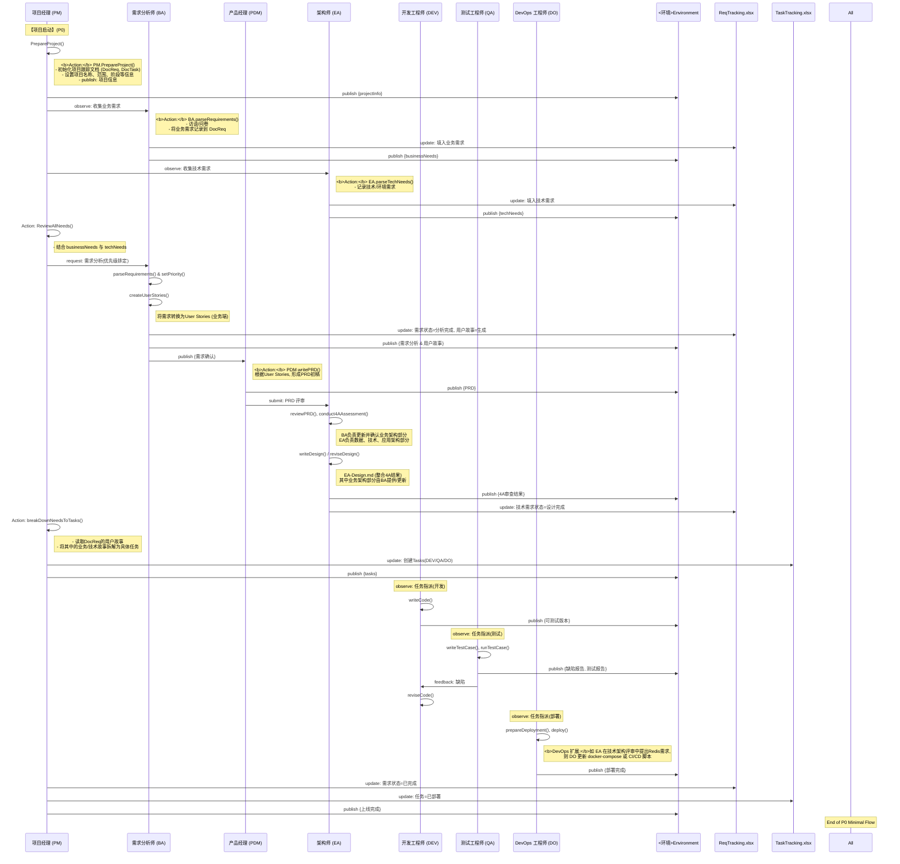

# AICO-Meta：基于多智能体的企业级软件研发框架

## 1. AICO-Meta 的定位

- **AICO-Meta** 并不是一个需要开发的具体业务系统，而是一个 **多智能体协同** 的 **企业级软件研发流程框架**。
- 框架通过配置各关键角色（如项目经理/PM、需求分析师/BA、产品经理/PDM、架构师/EA、开发/DEV、测试/QA、DevOps/DO 等）的 **SOP（标准作业流程）**，并结合 **LLM（大模型）** 或 **MetaGPT Agent** 提升角色的决策、文档生成、代码编写等能力，以 **规范并加速** 软件开发项目。

在此框架中，团队可灵活选择：
- “**真人角色 + Agent**” 协同，
- “**全自动 Agent**” 接管部分环节，
- 或纯粹人工流程（仅参考框架定义的 SOP 及文档模板）。

---
## 2. 分阶段实现规划 (P0 / P1 / P2)

AICO-Meta 的落地典型地分为三个阶段，方便在不同成熟度的企业中循序渐进：

1. **P0：最小可用闭环**
   - 搭建基础角色（BA、PDM、EA、DEV、QA、DO、PM），实现从需求到上线的**最小闭环**。
   - 目标：当用户提出业务/技术需求后，可以完成一次“需求→设计→实现→测试→部署”的端到端流程。

2. **P1：增强阶段**
   - 在 P0 的基础上，引入**项目管理能力**（项目阶段管理、自动化评审流程、CI/CD、回归测试等）。
   - 目标：提升研发效率和质量，减少人工重复操作，让各角色之间更**高度协同**。

3. **P2：高级阶段**
   - 扩展至生产级可观测性（监控、告警、数据分析）、安全合规、性能测试、用户反馈闭环等高级需求。
   - 目标：支撑中大型企业软件交付的完整流程，并能持续演进。

---
## 3. 角色与关键能力：分阶段说明

| 角色名称 | 核心业务能力 (Key Abilities) | 分阶段实现 (P0/P1/P2) |
| --- | --- | --- |
| **项目经理**<br>PM | - *端到端需求管理*<br>- `PrepareProject()`, `ReviewAllNeeds()`, `breakDownNeedsToTasks()`<br>- `writeTasks()`, `assignTask()`<br>- 项目进度跟踪、风险管理、资源协调 | **P0**：最基本的需求到上线流程<br>**P1**：引入项目阶段管理、复盘<br>**P2**：多项目、多团队管理 |
| 需求分析师<br>BA | - `parseRequirements()`：需求调研、需求澄清<br>- 确定优先级、用户故事拆解<br>- 负责4A中的**业务架构**部分<br>- 更新《需求跟踪表》(ReqTracking) | **P0**：收集并撰写需求<br>**P1**：持续需求沟通<br>**P2**：复杂业务建模、竞争分析 |
| 产品经理<br>PDM | - `writePRD()`, `revisePRD()`<br>- 定义验收标准<br>- 收集用户反馈并改进 | **P0**：撰写初版PRD<br>**P1**：多轮迭代<br>**P2**：用户反馈闭环 |
| 架构师<br>EA | - `reviewPRD()`, `writeDesign()`, `reviseDesign()`<br>- `conduct4AAssessment()`：4A(应用/数据/技术/安全)架构评估<br>- 除业务架构以外，其余3层(数据、技术、应用)由EA负责输出<br>- 评审核心代码 | **P0**：基础架构设计<br>**P1**：完善评审流程<br>**P2**：性能、安全、扩展性优化 |
| 开发工程师<br>DEV | - `writeCode()`, `reviewCode()`, `reviseCode()`, `debugReflection()`<br>- 提交可运行代码、修复缺陷 | **P0**：实现核心功能<br>**P1**：自动化单测、Review<br>**P2**：持续重构、性能优化 |
| 测试工程师<br>QA | - `writeTestCase()`, `runTestCase()`<br>- 自动化回归测试、测试报告<br>- 性能、安全、兼容性测试 | **P0**：功能测试<br>**P1**：自动化回归<br>**P2**：性能/安全/兼容测试 |
| DevOps 工程师<br>DO | - `prepareDeployment()`, `deploy()`<br>- 搭建CI/CD流水线<br>- **环境配置、监控、日志分析**<br>- **基于 4A 技术架构需求，对部署环境进行更新迭代（如新增中间件、Docker Compose 依赖等）** | **P0**：基础环境、部署<br>**P1**：CI/CD自动化<br>**P2**：可观测性、容器化、告警体系 |

> **说明**：在 4A 架构评审后，如果新增了中间件需求（如 Redis、MQ、ElasticSearch 等），由 **DevOps 工程师**（DO）在部署环境中做对应更新，如编写/修改 Docker Compose、配置 CI/CD 脚本等。

---
## 4. 整体流程：需求跟踪 -> 用户故事 -> 任务拆解

在 AICO-Meta 中，需求通常会经历三个层次的分解与落地：
1. **需求跟踪 (Requirement Tracking)**：由 BA 或 EA 收集业务需求与技术需求，并记录在《需求跟踪表》(ReqTracking.xlsx)。
   - BA 负责业务需求调研与记录
   - EA 负责技术需求调研与记录
2. **用户故事 (User Stories)**：对于业务需求，BA/PDM 会将其转化为用户故事（Story），使之更具备可理解的场景描述、验收标准等；对于技术需求，也可视为“技术故事”或“技术任务”，但往往只需在设计文档或需求跟踪表做“技术项目”标记。
3. **任务拆解 (Task Decomposition)**：最后，由 PM 将用户故事或技术项拆分为更具体的开发/测试/部署任务（登记在《任务跟踪表》(TaskTracking.xlsx) 中），并分配给相关角色。

> 在大型项目中，还可能进一步有 EPIC → Feature → Story → Task → Subtask 的多层结构，此处仅提供最常见的三层。

---
## 5. 详细时序与信息流 (P0 阶段示例)

下列示例时序图结合了更多 Action（包括角色 `observe` 和 `publish` 的内容），并突出显示了 **需求跟踪(Requirement)** → **用户故事(User Story)** → **任务(Task)** 的逐级拆解过程。此外，对于 4A 架构，BA 负责**业务架构**部分，EA 负责数据、技术、应用等其余三个维度，并共同更新同一个设计文档。



---
## 6. 各角色 Action 定义 & Observe/Publish 说明

### 6.1 项目经理 (PM)

- **Action**
  1. `PrepareProject()`
     - 初始化项目文档/表格 (ReqTracking.xlsx, TaskTracking.xlsx)
     - 设置项目基础信息（名称、范围、阶段）
     - Publish 项目信息 (如 `{projectInfo}`) 到 ENV
  2. `ReviewAllNeeds()`
     - 从 ENV 或 ReqTracking 中获取业务需求、技术需求，审阅优先级与可行性
  3. `breakDownNeedsToTasks()`
     - 读取用户故事 (UserStories) 并拆解成具体开发/测试/部署的任务
     - Update TaskTracking (TaskTracking.xlsx)
  4. `writeTasks()`, `assignTask()`（可视为更细分的拆解/分配操作）

- **Observe**
  - 当 BA/EA 发布 `{businessNeeds, techNeeds}` 时，PM 会进行 `ReviewAllNeeds()`
  - 当文档更新（如 ReqTracking.xlsx）完成需求分析后，PM 也可 `observe` 到需求状态

- **Publish**
  - `{projectInfo}`：初始化项目信息
  - `{tasks}`：当任务分配完毕后发布任务列表
  - `{上线完成}`：最终上线通知

### 6.2 需求分析师 (BA)

- **Action**
  1. `parseRequirements()`
     - 收集业务需求（与业务方访谈、问卷等）
     - 填写需求到 ReqTracking
  2. `setPriority()`
     - 根据业务价值、紧急程度等给需求排序
  3. `createUserStories()`
     - 将需求转换为用户故事 (User Story)
  4. (在4A架构阶段) 更新 **业务架构** 相关内容

- **Observe**
  - 当 PM 发起“需求收集”请求时，BA 开始调研并执行 `parseRequirements()`
  - 当需要对需求进行分析与优先级排定时，BA 开始执行 `setPriority()`
  - 当 EA 进行 4A 架构评审，需要业务架构部分信息

- **Publish**
  - `{businessNeeds}`：BA 收集到的业务需求
  - `{需求分析 & 用户故事}`：完成分析后

### 6.3 产品经理 (PDM)

- **Action**
  1. `writePRD()`
     - 根据 BA 的用户故事，撰写或修订 PRD
  2. `revisePRD()`
     - 后续多轮迭代时，修订 PRD

- **Observe**
  - 当 BA 发布了 `{需求分析 & 用户故事}` 时，PDM 即可创建/更新 PRD
  - 当 EA 或其他角色反馈架构/设计更改时，也可触发 `revisePRD()`

- **Publish**
  - `{PRD}`：完成 PRD 后发布
  - `{需求确认}`：与 BA 交互或需求方确认

### 6.4 架构师 (EA)

- **Action**
  1. `parseTechNeeds()`
     - 收集技术需求（环境、技术栈、基础设施）
  2. `reviewPRD()`
     - 审查 PRD 的技术可行性
  3. `conduct4AAssessment()`
     - 基于 4A(业务/数据/技术/应用/安全)进行架构评估(其中业务架构由BA完成或维护，EA需结合其余3层综合)
  4. `writeDesign()`, `reviseDesign()`
     - 形成或更新 EA-Design.md，整合4A各层；其中业务架构部分由 BA 提供/确认

- **Observe**
  - 当 PM 请求收集技术需求时
  - 当 PDM 发布 PRD，需要架构评审时

- **Publish**
  - `{techNeeds}`：技术需求
  - `{4A审查结果}`：架构评估结果
  - `{EA-Design.md}`：架构设计文档

### 6.5 开发工程师 (DEV)

- **Action**
  1. `writeCode()`
     - 根据任务 (Task) 编写或生成核心代码
  2. `reviewCode()`, `reviseCode()`
     - 对代码进行自检或互检，修复缺陷
  3. `debugReflection()`
     - 复杂场景下进行调试与性能优化

- **Observe**
  - 当 PM 发布了开发任务列表 `{tasks}`，DEV 观察到其中与自己相关的任务
  - 当 QA 发布缺陷报告

- **Publish**
  - `{可测试版本}`：开发完成后提供给 QA
  - `reviseCode()`：在修复缺陷后可再次发布更新

### 6.6 测试工程师 (QA)

- **Action**
  1. `writeTestCase()`
     - 编写测试用例 (功能/回归/压力等)
  2. `runTestCase()`
     - 执行测试，并生成测试报告

- **Observe**
  - 当分配到测试任务 `{tasks}`
  - 当 DEV 发布了 `{可测试版本}`

- **Publish**
  - `{缺陷报告}`：发现缺陷时
  - `{测试报告}`：执行测试的结果

### 6.7 DevOps 工程师 (DO)

- **Action**
  1. `prepareDeployment()`
     - 准备部署环境（CI/CD 配置、容器/服务器）
     - <b>根据 EA 的架构变更需求（如 Redis、MQ 等新组件），更新 Docker Compose 或相关脚本</b>
  2. `deploy()`
     - 将可测试或可上线版本部署到 SIT/PROD 环境

- **Observe**
  - 当 PM 发布了部署任务 `{tasks}`
  - 当 DEV/QA 在 ENV 中发布了可用版本
  - 当 EA 在架构评审中提出新环境/中间件需求

- **Publish**
  - `{部署完成}`：部署结果

---
## 7. P0 阶段 SOP 示范

此处为 P0 阶段，每个角色只需最核心的动作与文档能力：

1. **PM**
   - `PrepareProject()` → `ReviewAllNeeds()` → `breakDownNeedsToTasks()`
   - 关键输出：需求/用户故事/任务分配
2. **BA**
   - `parseRequirements()`, `createUserStories()`
   - 更新业务架构 (在4A设计中)
   - 发布需求 & 用户故事
3. **PDM**
   - `writePRD()`, `revisePRD()`
   - 与 BA、EA 对齐需求
4. **EA**
   - `parseTechNeeds()`, `writeDesign()`, `reviseDesign()`
   - 在4A中负责数据、技术、应用三部分
5. **DEV**
   - `writeCode()`, `reviseCode()`
   - 输出可测试版本
6. **QA**
   - `writeTestCase()`, `runTestCase()`
   - 输出缺陷或测试报告
7. **DO**
   - `prepareDeployment()`, `deploy()`
   - <b>根据最新架构变更，更新容器/环境配置后上线</b>

---
## 8. AICO-Meta 基于 MetaGPT 的实现清单

### 8.1 P0 阶段（最小可用闭环）
1. **核心角色扩展**
   - 在 MetaGPT 中，为 PM、BA、PDM、EA、DEV、QA、DO 定义对应的 `Role` 类；
   - 实现其最基础的 Action 方法 (如 `PrepareProject()`, `parseRequirements()`, `writeCode()`, etc.)。
2. **消息机制**
   - 建立 `ENV` 作为消息总线或共享上下文；
   - 每个角色在完成关键操作后 `publish(...)`，在合适时机 `observe(...)` 以获取最新信息。
3. **文档模板**
   - ReqTracking.xlsx、TaskTracking.xlsx、PRD、EA-Design.md、Testcase-Design.md、Deployment.md 等，均可在角色执行 Action 时自动生成或更新。
4. **最小工作流**
   - 确保在一次迭代中完成：需求收集→用户故事→任务拆解→开发→测试→部署。

### 8.2 后续阶段（P1 / P2）
1. **P1：增强**
   - 加入 Code Review、自动化测试框架、CI/CD 流水线等；
   - PM 的项目阶段管理 (`setPhases()`)、角色间自我反思 (`reflect()`)。
2. **P2：高级**
   - 性能与安全测试、容器化、监控告警、一键回滚、用户反馈分析等；
   - 多团队协作、多项目管理能力。

---
## 9. 改进与后续扩展

### 9.1 中间件需求与 DevOps 更新
- 为了更好地跟踪中间件变更（如新增 Redis、MQ、ES 等），可在 `TaskTracking.xlsx` 中建立“**环境变更**”或“**中间件更新**”类型的任务。
- 流程示例：
  1. EA 在 4A 架构评审中提出或更新中间件需求；
  2. PM 将该需求转为“环境变更任务”分配给 DO；
  3. DO 更新 Docker Compose、CI/CD 脚本；
  4. QA 执行环境验证测试（可加入到测试用例或单独一份部署验证脚本中）；
  5. 更新完毕后在 `TaskTracking.xlsx` 中标记完成。

### 9.2 各阶段产出物规范
- 建议为以下文档产物定义更详细的结构与模板：
  - **ReqTracking.xlsx**：需求ID、需求类型、优先级、状态、对应用户故事、备注等；
  - **TaskTracking.xlsx**：任务ID、类型(开发/测试/环境变更等)、负责人、状态、起止时间等；
  - **PRD**：可定义章节如 背景、用户故事、验收标准等；
  - **EA-Design.md**：4A结构，包括业务架构(BA 负责)与数据/技术/应用架构(EA 负责)；
  - **Deployment.md**：可包含环境拓扑、Docker Compose 样例、CI/CD 流程说明等。
- 更详细的文档模板可视为 P1/P2 阶段的下一步工作，以帮助团队对每个产物“写什么、审核什么”有清晰指引。

### 9.3 迭代管理 & Scrum/Sprint 规划
- 当前流程相对“瀑布式”，只要“需求→用户故事→任务→实现→测试→部署”即可跑通；
- 在后续若引入敏捷开发/Scrum，可在**P1/P2**时增加：
  - Sprint 规划、燃尽图、每日站会、迭代回顾等；
  - 与现有的用户故事/任务体系对接（例如将用户故事放进团队的 Backlog）;
  - 让整个框架兼容敏捷实践。

### 9.4 在 MetaGPT 中的执行：API/消息结构 & 函数签名
- **基础概念**：
  - `ENV`：一个全局消息总线或共享上下文；
  - 每个 `Role` 可以在自己的类中定义 Action 方法，并通过 `observe`/`publish` 函数与 `ENV` 交互；
- **示例函数签名**：
  ```python
  class ProjectManager(Role):
      def prepare_project(self, project_info: dict) -> None:
          """
          Action: 初始化项目文档并发布项目信息到 ENV。
          :param project_info: 包含项目名称、范围、阶段等信息
          :return: None
          """
          # ...具体逻辑...
          self.publish("projectInfo", project_info)

      def review_all_needs(self) -> None:
          """
          Action: 审阅全部业务/技术需求，合并到ENV 或内部状态。
          """
          # observe from ENV
          needs = self.observe("businessNeeds") + self.observe("techNeeds")
          # ...处理合并/优先级判断...

      def break_down_needs_to_tasks(self) -> None:
          """
          Action: 将用户故事等需求拆解为任务，并发布到ENV。
          """
          user_stories = self.observe("userStories")
          # ...拆解逻辑...
          self.publish("tasks", tasks_list)
  ```
  - 其中 `self.observe("type")` 表示从 `ENV` 中获取特定类型消息；`self.publish("type", payload)` 表示往 `ENV` 中发布消息；
  - 实际实现可根据 MetaGPT 的具体接口进行调整。

- **其余角色** 类似地在自己的方法中进行 `observe`(监听)、`publish`(输出)；同时通过**文档生成/更新**API（如 `generate_doc()`）来维护 ReqTracking.xlsx、EA-Design.md 等。

- **消息结构**：
  - 通常可采用 `{"type": "businessNeeds", "payload": {...}}` 的 JSON 格式，也可更复杂；
  - 在 P0 阶段不必过度复杂，只需确认每种类型(`businessNeeds`, `techNeeds`, `PRD`, `tasks`, `可测试版本`等) 对应的数据结构即可。

---
## 10. 总结与建议

- **AICO-Meta** 并非强制固定某一模式，而是提供一种 **多智能体与角色 SOP** 的可扩展流程；
- “需求跟踪 → 用户故事 → 任务拆解” 能在小团队快速落地，也能与大型项目管理体系(Jira/Confluence等)对接；
- 建议在 **P0** 阶段先跑通最小闭环，将角色/Action/文档管理基本打通；之后再演进到 **P1/P2**，并结合敏捷实践或更完备的文档模板。

如有其他问题或需要细化的节点，可在此框架之上继续补充或调整。

