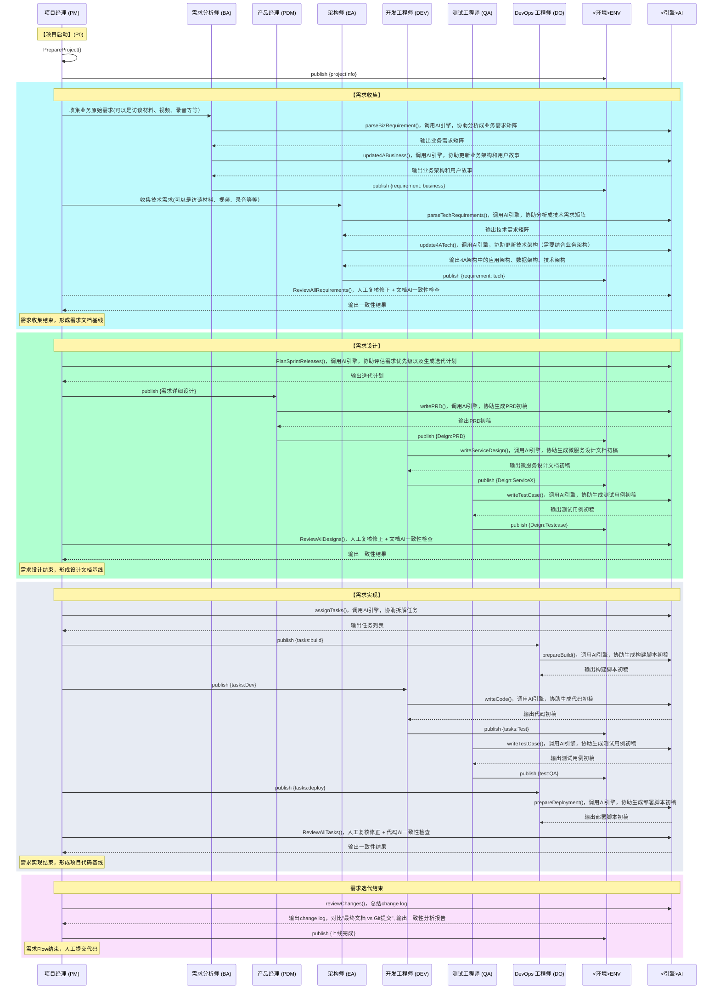

# AICO-Meta：基于多智能体的企业级软件研发框架（**整合更新版**）

## 1. AICO-Meta 的定位

- **AICO-Meta** 并不是一个需要开发的具体业务系统，而是一个 **多智能体协同** 的 **企业级软件研发流程框架**。
- 框架通过配置各关键角色（如项目经理/PM、需求分析师/BA、产品经理/PDM、架构师/EA、开发/DEV、测试/QA、DevOps/DO 等）的 **SOP（标准作业流程）**，并结合 **LLM（大模型）** 或 **MetaGPT Agent** 提升角色的决策、文档生成、代码编写等能力，以 **规范并加速** 软件开发项目。

在此框架中，团队可灵活选择：

- "**真人角色 + Agent**" 协同；
- "**全自动 Agent**" 接管部分环节；
- 或纯粹人工流程（仅参考框架定义的 SOP 及文档模板）。

---

## 2. 分阶段实现规划 (P0 / P1 / P2)

AICO-Meta 的落地一般分为三个阶段，便于在不同企业环境中循序渐进：

1. **P0：最小可用闭环**

   - 搭建基础角色（BA、PDM、EA、DEV、QA、DO、PM），实现从需求到上线的**最小闭环**。
   - 目标：当用户提出业务/技术需求后，可完成一次"需求→设计→实现→测试→部署"的端到端流程。

2. **P1：增强阶段**

   - 在 P0 的基础上，引入**项目管理能力**（项目阶段、自动化评审流程、CI/CD、回归测试等）。
   - 目标：**提升研发效率与质量**，减少人工重复操作，让各角色之间更**高度协同**。

3. **P2：高级阶段**

   - 加入更多高级功能，如可观测性、性能/安全测试、用户反馈闭环等。
   - 目标：**支撑中大型企业软件交付**的完整流程，并能持续演进。

---

## 3. 角色与关键能力：分阶段说明

| 角色名称            | 核心业务能力 (Key Abilities)                                                                                                                                                 | 分阶段实现 (P0/P1/P2)                                                                 |
|---------------------|-----------------------------------------------------------------------------------------------------------------------------------------------------------------------------|-------------------------------------------------------------------------------------|
| **项目经理 (PM)**   | - 端到端需求管理（`PrepareProject`/`ReviewAllRequirements`）<br>- 迭代计划制定（`PlanSprintReleases`）<br>- 任务拆解与分配（`assignTasks`）<br>- 项目协调与基线管理（三次Review动作） | **P0**：<br>• 需求→上线基础流程<br>• 三次基线评审<br>**P1**：<br>• 迭代阶段管理<br>**P2**：<br>• 多项目协同            |
| 需求分析师 (BA)      | - 业务需求解析（`parseRequirement`）<br>- 用户故事拆解<br>- 业务架构维护（`update4ABusiness`）<br>- 需求跟踪矩阵维护                                                                 | **P0**：<br>• 需求矩阵生成<br>• 用户故事初稿<br>**P1**：<br>• 需求变更管理<br>**P2**：<br>• 复杂业务建模              |
| 产品经理 (PDM)      | - PRD文档编写（`writePRD`）<br>- 验收标准定义<br>- 需求设计阶段协同                                                                                                                                 | **P0**：<br>• PRD初稿生成<br>**P1**：<br>• 多版本迭代<br>**P2**：<br>• 用户反馈闭环                                  |
| 架构师 (EA)        | - 技术需求解析（`parseTechRequirements`）<br>- 4A架构设计（`update4ATech`）<br>- 架构评审（时序图中设计阶段参与）<br>- 技术方案一致性保障                                                           | **P0**：<br>• 4A架构初稿<br>• 技术需求矩阵<br>**P1**：<br>• 架构评审流程<br>**P2**：<br>• 性能/安全专项优化           |
| 开发工程师 (DEV)     | - 微服务设计（`writeServiceDesign`）<br>- 代码实现（`writeCode`）<br>- 代码评审（时序图中实现阶段）<br>- 缺陷修复                                                                               | **P0**：<br>• 服务设计文档<br>• 核心功能代码<br>**P1**：<br>• 单测覆盖<br>**P2**：<br>• 持续重构                    |
| 测试工程师 (QA)      | - 测试用例设计（`writeTestCase`）<br>- 测试执行（`runTestCase`）<br>- 测试报告生成（时序图灰色阶段）                                                                                          | **P0**：<br>• 功能测试用例<br>• 基础测试报告<br>**P1**：<br>• 自动化回归<br>**P2**：<br>• 性能/安全测试              |
| DevOps 工程师 (DO) | - 构建脚本生成（`prepareBuild`）<br>- 部署脚本生成（`prepareDeployment`）<br>- 环境配置（时序图实现阶段）<br>- CI/CD流水线维护                                                                 | **P0**：<br>• 基础环境搭建<br>• 部署脚本初稿<br>**P1**：<br>• CI/CD流水线<br>**P2**：<br>• 可观测性体系               |


> **说明**：在 4A 架构评审后，如果需要新增中间件（Redis、MQ、ElasticSearch 等），则由 **DevOps 工程师 (DO)** 在部署环境中做相应更新（如 Docker Compose、CI/CD 配置等）。

---

## 4. 整体流程：需求跟踪 → 用户故事 → 任务拆解

典型的需求实现流程如下：

1. **需求跟踪 (Requirement Tracking)**
   - BA、EA 分别负责记录业务需求与技术需求，全部命名为 requirement 并写入 ReqTracking.xlsx。
2. **用户故事 (User Stories)**
   - BA/PDM 将业务需求拆解为用户故事 (Story)；EA 若有技术需求，也可转化为技术故事或技术任务。
3. **任务拆解 (Task Decomposition)**
   - PM 根据用户故事拆解为更小的开发/测试/部署任务，放在 TaskTracking.xlsx 中，分配给相应角色。

对大型项目，可进一步扩展到 EPIC → Feature → Story → Task → Subtask 等多层结构。

---

## 5. 详细时序与信息流 (P0 阶段)

在 **P0** 阶段，完整流程分为四个核心阶段，形成"AI生成+人工复核"的双重校验机制：



**流程阶段说明**：

1. **需求收集阶段（蓝色）**
   - **核心动作**：PM初始化项目 → BA/EA分别收集业务/技术需求 → AI辅助生成需求矩阵 → 人工复核确认
   - **关键产出**：业务需求矩阵、技术需求矩阵、4A架构初稿
   - **质量关卡**：PM执行`ReviewAllRequirements()`进行需求基线确认

2. **需求设计阶段（绿色）**
   - **核心动作**：AI生成迭代计划 → PDM生成PRD → DEV生成微服务设计 → QA生成测试用例 → 人工复核设计
   - **关键产出**：PRD文档、微服务设计文档、测试用例文档
   - **质量关卡**：PM执行`ReviewAllDesigns()`进行设计基线确认

3. **需求实现阶段（灰色）**
   - **核心动作**：任务拆解 → DO生成构建脚本 → DEV生成代码 → QA生成测试 → DO生成部署脚本 → 人工复核实现
   - **关键产出**：可运行代码、测试报告、部署脚本
   - **质量关卡**：PM执行`ReviewAllTasks()`进行代码基线确认

4. **迭代收尾阶段（紫色）**
   - **核心动作**：AI生成变更日志 → 文档代码一致性检查 → 人工确认上线
   - **关键产出**：变更日志、一致性分析报告

---

## 6. 各角色 Action 定义 & Observe/Publish

### 6.1 需求收集阶段角色

#### 项目经理 (PM)
- **Action**: `PrepareProject()`：初始化项目，包含项目配置、团队组建、技术栈选型
- **Publish**: `{projectInfo}`项目基础配置信息

#### 需求分析师 (BA)
- **Action**: `parseBizRequirement()`：分析业务需求，包含用户故事编写、业务流程梳理、需求优先级排序
- **Observe**: `{projectInfo}`触发需求收集
- **Publish**: `{requirement}`业务需求文档

#### 架构师 (EA)
- **Action**: `parseTechRequirements()`：分析技术需求，包含性能指标、安全要求、系统约束
- **Observe**: `{projectInfo}`触发需求收集
- **Publish**: `{requirement}`技术需求文档

### 6.2 需求设计阶段角色

#### 项目经理 (PM)
- **Action**: `PlanSprintReleases()`：制定迭代计划，包含需求分解、任务排期
- **Publish**: `{需求详细设计}`触发设计阶段

#### 产品经理 (PDM)
- **Action**: `writePRD()`：编写产品需求，包含功能描述、交互设计、验收标准
- **Observe**: `{需求详细设计}`触发PRD编写
- **Publish**: `{PRD}`产品需求文档

#### 开发工程师 (DEV)
- **Action**: `writeServiceDesign()`：微服务设计，包含接口设计、数据模型设计
- **Observe**: `{需求详细设计}`触发服务设计
- **Publish**: `{服务设计文档}`服务设计方案

### 6.3 需求实现阶段角色

#### 项目经理 (PM)
- **Action**: `assignTasks()`：任务分配与跟踪，包含工作量评估、进度监控
- **Publish**: `{tasks:build}`, `{tasks:Dev}`, `{tasks:deploy}`任务清单

#### DevOps工程师 (DO)
- **Action**: `prepareDeployment()`：部署准备，包含环境配置、部署脚本编写
- **Observe**: `{tasks:deploy}`部署任务
- **Publish**: `{部署脚本}`部署配置

#### 开发工程师 (DEV)
- **Action**: `writeCode()`：代码开发，包含功能实现、单元测试编写
- **Observe**: `{tasks:Dev}`开发任务
- **Publish**: `{可测试版本}`代码提交

#### 测试工程师 (QA)
- **Action**: `writeTestCase()`：测试用例编写，包含功能测试、接口测试
- **Observe**: `{tasks:Test}`测试任务
- **Publish**: `{test:QA}`测试报告

### 6.4 迭代收尾阶段角色

#### 项目经理 (PM)
- **Action**: `reviewChanges()`：变更审查，包含代码变更分析、文档更新检查
- **Observe**: 所有实现产物
- **Publish**: `{上线完成}`变更日志

---

## 7. P0 阶段 SOP 示范（流程细化）

1. **需求收集阶段**
   - PM：执行`PrepareProject()`初始化 → 发布`{projectInfo}`
   - BA/EA：并行执行`parseBizRequirement()`/`parseTechRequirements()` → 发布`{requirement}`
   - PM：执行`ReviewAllRequirements()`完成需求基线

2. **需求设计阶段**
   - PM：调用`PlanSprintReleases()`生成迭代计划 → 发布`{需求详细设计}`
   - PDM/DEV/QA：并行生成PRD/服务设计/测试用例 → 发布设计文档
   - PM：执行`ReviewAllDesigns()`完成设计基线

3. **需求实现阶段**
   - PM：执行`assignTasks()`发布`{tasks:build}`,`{tasks:Dev}`,`{tasks:deploy}`
   - DO/DEV/QA：并行处理构建/编码/测试 → 发布实现产物
   - PM：执行`ReviewAllTasks()`完成代码基线

4. **迭代收尾**
   - PM：调用`commitChanges()`生成变更日志
   - AI：自动执行文档代码一致性检查
   - PM：人工确认后发布`{上线完成}`

---

## 8. AICO-Meta 基于 MetaGPT 的实现清单

### 8.1 P0 阶段（最小可用闭环）

1. **核心角色扩展**

   - 在 MetaGPT 中，为 PM、BA、PDM、EA、DEV、QA、DO 定义各自 `Role` 类；
   - 实现最基础的 Action (如 `PrepareProject()`, `parseBizRequirement()`, `writeServiceDesign()`, `writeCode()`, etc.)。

2. **消息机制**

   - 建立 `ENV` 作为消息总线；
   - 角色完成 Action 后 `publish(...)`，其它角色 `observe(...)` 获取并处理。

3. **文档模板**

   - ReqTracking.xlsx, TaskTracking.xlsx, PRD, EA-Design.md, ServiceX-Design.md, Testcase-Design.md, Deployment.md 等，均可在角色执行 Action 时自动生成或更新。
   - 在"AI+人机协同"模式下，可由 AI 先生成初稿，人工再修订并发布最终版。

4. **最小工作流**

   - 需求收集 → 用户故事 → 架构设计 → 微服务设计 → 开发 → 测试 → 部署
   - 对应的关键角色 SOP 已在前文列出。

### 8.2 后续阶段（P1 / P2）

1. **P1：增强**

   - 项目阶段管理 (`setPhases()`)、自动化评审、CI/CD、自动化回归测试等
   - 让更多日常操作自动化，减少人工干预。

2. **P2：高级**

   - 性能/安全测试、容器化、监控告警、一键回滚、用户反馈分析等
   - 多团队协作、多项目管理
   - 进一步提高 AI 自动化水平，如自动合并代码、自动回滚等。

---

## 9. 改进与后续扩展

### 9.1 中间件需求与 DevOps 更新

- 为了更好地跟踪中间件变更（如新增 Redis、MQ、ES 等），可在 `TaskTracking.xlsx` 中建立"**环境变更**"或"**中间件更新**"类型的任务。
- 流程示例：
  1. EA 在 4A 架构评审中提出或更新中间件需求；
  2. PM 将该需求转为"环境变更任务"分配给 DO；
  3. DO 更新 Docker Compose、CI/CD 脚本；
  4. QA 执行环境验证测试（可加入到测试用例或单独一份部署验证脚本中）；
  5. 更新完毕后在 `TaskTracking.xlsx` 中标记完成。

### 9.2 各阶段产出物规范

以下为各常见文档及其建议内容，尤其针对 **EA-Design.md** 与 **Service-Level-Design** 做了更详细说明。

1. **ReqTracking.xlsx**

   - 记录业务/技术需求，如需求ID、需求类型(业务/技术)、优先级、状态(新建、分析中、已完成等)、对应用户故事、备注等。
   - BA、EA 分别维护业务/技术需求，并在需求分析后更新状态。

2. **TaskTracking.xlsx**

   - 列出具体任务，如 任务ID、任务类型(开发、测试、环境变更等)、负责人、状态(未开始/进行中/已完成)、起止时间、关联用户故事ID 等。
   - 由 PM 创建并跟踪，DEV/QA/DO 在此更新进度或完成度。

3. **PRD (Product Requirement Document)**

   - Typically 由 PDM 编写，主要涵盖：
     - 背景和目标
     - 用户故事 (BA 提供)
     - 功能清单/验收标准
     - 产品原型(如果需要)
   - 在 P1/P2 时可扩展多轮迭代/版本管理。

4. **EA-Design.md（系统级/跨微服务的高阶设计文档）**

   - **整体微服务拓扑图**：罗列所有服务与其职责边界、接口调用关系、数据流走向。
   - **关键非功能特性**：高可用、容灾、弹性伸缩、网关/负载均衡方案等。
   - **技术框架选型**：语言、通信协议（REST/gRPC）、中间件(缓存/队列)等。
   - **4A 架构**：
     - 业务架构(BA 提供/确认整体流程)
     - 数据架构(数据库拆分、中心 DB vs. 各微服务独立 DB)
     - 技术架构(服务框架、通信模式、消息队列、CI/CD 等)
     - 应用架构(服务边界、API 级别描述、安全/权限模型)
   - **目标**：让团队对整个系统的全局宏观结构一目了然。

5. **Service-Level-Design (如 ********************************`ServiceX-Design.md`********************************)**

   - **各微服务的详细设计**，由 DEV 或对应服务负责人编写、EA 评审：
     - **功能/模块拆分**：该服务具体提供哪些业务功能？
     - **数据库设计**：表结构、索引、分区策略(若有)等。
     - **接口定义**：对外暴露 API (REST/gRPC)、消息格式、错误码等。
     - **内部业务流程**：核心逻辑、状态机、异常处理；是否需要缓存/熔断/重试机制。
     - **性能/故障考虑**：是否需负载均衡、限流、日志监控等。
   - **目标**：对每个微服务的内部实现细节进行更深入的设计和记录，保持与 EA-Design.md 的整体架构一致。

6. **Testcase-Design.md**

   - QA 编写：列出功能/回归/压力等测试用例；描述用例步骤、期望结果、实际结果。
   - 在 P1/P2 可扩展自动化测试脚本、覆盖率分析等。

7. **Deployment.md**

   - 由 DO 编写：记录环境拓扑、Docker Compose 示例、CI/CD 流程说明。
   - 如果架构变更（新增 Redis、MQ），也要同步更新本文档，便于后续维护。

### 9.3 迭代管理 & 敏捷实践

- 在 P0 中主要跑通最小闭环；
- P1/P2 若采用 Scrum，可加上 Sprint 规划、看板、燃尽图、每日站会、迭代回顾等；
- 用户故事/任务可与 Jira/Trello/Confluence 等工具结合，进行 Backlog 管理和持续迭代。

### 9.4 在 MetaGPT 中的执行：API/消息结构 & 函数签名

- **基础概念**：

  - `ENV`：一个全局消息总线或共享上下文；
  - 每个 `Role` 可以在自己的类中定义 Action 方法，并通过 `observe`/`publish` 函数与 `ENV` 交互；

- **示例函数签名**：

  ```python
  class ProjectManager(Role):
      def prepare_project(self, project_info: dict) -> None:
          """
          Action: 初始化项目文档并发布项目信息到 ENV。
          :param project_info: 包含项目名称、范围、阶段等信息
          :return: None
          """
          # ...具体逻辑...
          self.publish("projectInfo", project_info)

      def review_all_requirements(self) -> None:
          """
          Action: 审阅全部业务/技术需求，合并到ENV 或内部状态。
          """
          # observe from ENV
          needs = self.observe("requirement")
          # ...处理合并/优先级判断...

      def break_down_requirements_to_tasks(self) -> None:
          """
          Action: 将用户故事等需求拆解为任务，并发布到ENV。
          """
          user_stories = self.observe("userStories")
          # ...拆解逻辑...
          self.publish("tasks", tasks_list)
  ```

  - 其中 `self.observe("type")` 表示从 `ENV` 中获取特定类型消息；`self.publish("type", payload)` 表示往 `ENV` 中发布消息；
  - 实际实现可根据 MetaGPT 的具体接口进行调整。

- **其余角色**：

  - 在自己的方法中进行 `observe`(监听)、`publish`(输出)；
  - 通过**文档生成/更新**API（如 \`generate\_doc()）来维护 ReqTracking.xlsx、EA-Design.md 等；
  - 在需要时可调用 AI 做"自动补全/生成"，再由人工或其他角色评审确认。

- **消息结构**：

  - 通常可采用 `{"type": "requirement", "payload": {...}}` 的 JSON 格式，也可更复杂；
  - 在 P0 阶段不必过度复杂，只需确认每种类型(`requirement`, `PRD`, `tasks`, `可测试版本`等) 对应的数据结构即可。

---

## 10. 参考资料

- [MetaGPT 官方文档](https://metagpt.readthedocs.io/en/latest/)
- [MetaGPT 示例项目](https://github.com/OpenBMB/MetaGPT)
- [MetaGPT 源码](https://github.com/OpenBMB/MetaGPT)

---

## 11. 端到端一致性复核（可选增强）

在完成 **需求分析阶段** 与 **需求实现阶段** 后，为了确保**文档与代码**不存在偏差，可让 AI 对比：

1. **Git 提交记录**（代码改动）与**最终文档**(PRD, EA-Design, Service-Level-Design 等)之间的差异；
2. 若 AI 发现明显冲突或未更新文档之处，则输出一个差异报告；
3. 由 **PM/EA/DEV 等**进行人工决策，**是否**要修订文档或进行代码回退/调整；
4. 形成最终一致的 **上线基线**。

在 P0 初期，此步骤可采用**人工**查看或简单脚本进行；在 P1/P2 阶段再与更多自动化工具（如 CI/CD、变更审计）结合，构建**更高自动化**的一致性审查流程。

---


