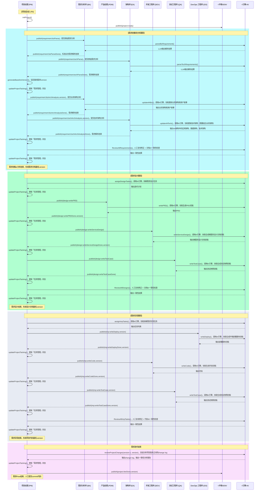

# AICO-Meta：基于多智能体的企业级软件研发框架（**整合更新版**）

## 1. AICO-Meta 的定位

- **AICO-Meta** 并不是一个需要开发的具体业务系统，而是一个 **多智能体协同** 的 **企业级软件研发流程框架**。
- 框架通过配置各关键角色（如项目经理/PM、需求分析师/BA、产品经理/PDM、架构师/EA、开发/DEV、测试/QA、DevOps/DO 等）的 **SOP（标准作业流程）**，并结合 **LLM（大模型）** 或 **MetaGPT Agent** 提升角色的决策、文档生成、代码编写等能力，以 **规范并加速** 软件开发项目。

在此框架中，团队可灵活选择：

- "**真人角色 + Agent**" 协同；
- "**全自动 Agent**" 接管部分环节；
- 或纯粹人工流程（仅参考框架定义的 SOP 及文档模板）。

---

## 2. 分阶段实现规划 (P0 / P1 / P2)

AICO-Meta 的落地一般分为三个阶段，便于在不同企业环境中循序渐进：

1. **P0：最小可用闭环**

   - 搭建基础角色（BA、PDM、EA、DEV、QA、DO、PM），实现从需求到上线的**最小闭环**。
   - 目标：当用户提出业务/技术需求后，可完成一次"需求→设计→实现→测试→部署"的端到端流程。

2. **P1：增强阶段**

   - 在 P0 的基础上，引入**项目管理能力**（项目阶段、自动化评审流程、CI/CD、回归测试等）。
   - 目标：**提升研发效率与质量**，减少人工重复操作，让各角色之间更**高度协同**。

3. **P2：高级阶段**

   - 加入更多高级功能，如可观测性、性能/安全测试、用户反馈闭环等。
   - 目标：**支撑中大型企业软件交付**的完整流程，并能持续演进。

---

## 3. 角色与关键能力：分阶段说明

| 角色名称            | 核心业务能力 (Key Abilities)                                                                                                                                                 | 分阶段实现 (P0/P1/P2)                                                                 |
|---------------------|-----------------------------------------------------------------------------------------------------------------------------------------------------------------------------|-------------------------------------------------------------------------------------|
| **项目经理 (PM)**   | - 端到端需求管理（`initProject`/`updateProjectTracking`） - 需求基线管理（`generateBaselineVersion`/`ReviewAllRequirements`） - 任务拆解与分配（`assignDesignTasks`/`assignImpTasks`） - 变更闭环管理（`reviewProjectChanges`） | **P0**： • 三次基线评审（需求/设计/实现） • 任务状态跟踪 **P1**： • 迭代阶段管理 **P2**： • 多项目协同            |
| 需求分析师 (BA)      | - 业务需求解析（`parseBizRequirement`） - 用户故事生成（`update4ABiz`） - 业务架构维护（`update4ABiz`） - 需求状态反馈                                                                 | **P0**： • 需求矩阵生成 • 用户故事初稿 **P1**： • 需求变更影响分析 **P2**： • 复杂业务建模              |
| 产品经理 (PDM)      | - PRD文档编写（`writePRD`） - 验收标准定义 - 需求设计协同（响应`design:writePRD`信号）                                                                                                         | **P0**： • PRD初稿生成 **P1**： • 多版本PRD管理 **P2**： • 用户反馈闭环                                  |
| 架构师 (EA)        | - 技术需求解析（`parseTechRequirements`） - 4A架构设计（`update4ATech`） - 技术方案评审（参与`ReviewAllDesigns`） - 技术需求跟踪                                                                 | **P0**： • 4A架构初稿 • 技术需求矩阵 **P1**： • 架构变更控制 **P2**： • 性能/安全专项优化           |
| 开发工程师 (DEV)     | - 微服务设计（`writeServiceDesign`） - 代码实现（`writeCode`） - 代码评审（参与`ReviewAllImpTasks`） - 缺陷修复                                                                               | **P0**： • 服务设计文档 • 核心功能代码 **P1**： • 单测覆盖 **P2**： • 持续重构                    |
| 测试工程师 (QA)      | - 测试用例设计（`writeTestCase`） - 测试执行（`runTestCase`） - 测试报告生成（响应`imp:writeTestCase`信号）                                                                                          | **P0**： • 功能测试用例 • 基础测试报告 **P1**： • 自动化回归 **P2**： • 性能/安全测试              |
| DevOps 工程师 (DO) | - 环境配置（响应`imp:writeDeploy`信号） - 部署脚本生成（`writeDeploy`） - 构建脚本生成（`prepareBuild`） - 部署验证                                                                 | **P0**： • 基础环境搭建 • 部署脚本初稿 **P1**： • CI/CD流水线 **P2**： • 可观测性体系               |

> **说明**：在 4A 架构评审后，如果需要新增中间件（Redis、MQ、ElasticSearch 等），则由 **DevOps 工程师 (DO)** 在部署环境中做相应更新（如 Docker Compose、CI/CD 配置等）。

---

## 4. 整体流程：需求跟踪 → 用户故事 → 任务拆解

典型的需求实现流程如下：

1. **原始需求跟踪**
   - PM 统一管理 ProjectTasking.xlsx 的「原始需求」Sheet，记录所有原始材料
   - BA/EA 完成解析后向 PM 反馈状态（parsed_by_ba/parsed_by_ea）
   
2. **需求管理**
   - PM 根据 BA/EA 的解析结果更新「需求管理」Sheet
   - 执行`ReviewAllRequirements()`完成需求基线

3. **用户故事管理**
   - PM 根据 PDM/BA 的拆解结果维护「用户故事管理」Sheet
   - 用户故事状态通过任务完成情况自动更新

4. **任务跟踪**
   - PM 通过`assignTasks()`发布开发/测试/部署任务
   - 各角色完成任务后向 PM 反馈状态（通过publish机制）

对大型项目，可进一步扩展到 EPIC → Feature → Story → Task → Subtask 等多层结构。

---

## 5. 详细时序与信息流 (P0 阶段更新版)

**流程阶段说明**：

1. **需求收集阶段（蓝色）**
   - **核心动作**：PM初始化项目 → BA/EA分别收集业务/技术需求 → AI辅助生成需求矩阵 → 人工复核确认
   - **关键产出**：业务需求矩阵、技术需求矩阵、4A架构初稿
   - **质量关卡**：PM执行`ReviewAllRequirements()`进行需求基线确认

2. **需求设计阶段（绿色）**
   - **核心动作**：AI生成迭代计划 → PDM生成PRD → DEV生成微服务设计 → QA生成测试用例 → 人工复核设计
   - **关键产出**：PRD文档、微服务设计文档、测试用例文档
   - **质量关卡**：PM执行`ReviewAllDesigns()`进行设计基线确认

3. **需求实现阶段（灰色）**
   - **核心动作**：任务拆解 → DO生成构建脚本 → DEV生成代码 → QA生成测试 → DO生成部署脚本 → 人工复核实现
   - **关键产出**：可运行代码、测试报告、部署脚本
   - **质量关卡**：PM执行`ReviewAllTasks()`进行代码基线确认

4. **迭代收尾阶段（紫色）**
   - **核心动作**：AI生成变更日志 → 文档代码一致性检查 → 人工确认上线
   - **关键产出**：变更日志、一致性分析报告

---

## 6. 各角色 Action 定义 & Observe/Publish

### 6.1 需求收集阶段角色

#### 项目经理 (PM)
- **Action**: 
  - `initProject()`：初始化项目环境
  - `generateBaselineVersion()`：生成需求基线版本
  - `updateProjectTracking(data)`：更新项目跟踪表
- **Publish**: 
  - `project:ready` 项目就绪信号
  - `requirment:bizParse` 触发业务需求分析
  - `requirment:techParse` 触发技术需求分析
  - `requirment:bizArchAnalysis` 触发业务架构分析
  - `requirment:techArchAnalysis` 触发技术架构分析

#### 需求分析师 (BA)
- **Observe**: `requirment:bizParse`, `requirment:bizArchAnalysis`
- **Action**:
  - `parseBizRequirement()`：解析原始业务需求
  - `update4ABiz()`：更新业务架构和用户故事
- **Publish**: 
  - `requirment:bizParseDone` 业务需求解析完成
  - `requirment:bizArchAnalysisDone` 业务架构分析完成

#### 架构师 (EA)
- **Observe**: `requirment:techParse`, `requirment:techArchAnalysis`
- **Action**:
  - `parseTechRequirements()`：解析技术需求
  - `update4ATech()`：更新技术架构
- **Publish**: 
  - `requirment:techParseDone` 技术需求解析完成
  - `requirment:techArchAnalysisDone` 技术架构分析完成

### 6.2 需求设计阶段角色

#### 项目经理 (PM)
- **Action**: 
  - `assignDesignTasks()`：分配设计任务
  - `ReviewAllDesigns()`：设计文档评审
- **Publish**:
  - `design:writePRD` 触发PRD编写
  - `design:writeServiceDesign` 触发服务设计
  - `design:writeTestCase` 触发测试用例设计

#### 产品经理 (PDM)
- **Observe**: `design:writePRD`
- **Action**: `writePRD()`：生成产品需求文档
- **Publish**: `design:writePRDDone` PRD文档完成

#### 开发工程师 (DEV)
- **Observe**: `design:writeServiceDesign`
- **Action**: `writeServiceDesign()`：生成微服务设计文档
- **Publish**: `design:writeServiceDesignDone` 服务设计完成

#### 测试工程师 (QA)
- **Observe**: `design:writeTestCase`
- **Action**: `writeTestCase()`：生成测试用例初稿
- **Publish**: `design:writeTestCaseDone` 测试用例设计完成

### 6.3 需求实现阶段角色

#### 项目经理 (PM)
- **Action**: 
  - `assignImpTasks()`：分配实现任务
  - `ReviewAllImpTasks()`：实现成果评审
- **Publish**: 
  - `imp:writeDeploy` 触发部署脚本编写
  - `imp:writeCode` 触发代码开发
  - `imp:writeTestCase` 触发测试用例执行

#### DevOps工程师 (DO)
- **Observe**: `imp:writeDeploy`
- **Action**: `writeDeploy()`：生成部署脚本
- **Publish**: `imp:writeDeployDone` 部署脚本完成

#### 开发工程师 (DEV)
- **Observe**: `imp:writeCode`
- **Action**: `writeCode()`：生成功能代码
- **Publish**: `imp:writeCodeDone` 代码开发完成

#### 测试工程师 (QA)
- **Observe**: `imp:writeTestCase`
- **Action**: 
  - `runTestCase()`：执行测试用例
  - `generateTestReport()`：生成测试报告
- **Publish**: `imp:writeTestCaseDone` 测试执行完成

### 6.4 迭代收尾阶段角色

#### 项目经理 (PM)
- **Action**: `reviewProjectChanges()`：分析版本变更
- **Publish**: `project:IterDone` 迭代完成信号
- **Observe**: 所有实现阶段的完成信号

---

## 7. P0 阶段 SOP 示范（流程细化）

1. **需求收集阶段**
   - PM：执行`initProject()` → 发布`{project:ready}`
   - BA：接收`{requirement:bizParse}` → 发布`{requirement:bizParseDone}`
   - EA：接收`{requirement:techParse}` → 发布`{requirement:techParseDone}`
   - PM：执行`trackRequirement()`更新跟踪表

2. **需求设计阶段**
   - PM：发布`{design:writePRD}`/`{design:writeServiceDesign}`/`{design:writeTestCase}`
   - PDM/DEV/QA：完成设计后发布完成信号（如`{design:writePRDDone}`）
   - PM：执行`updateProjectTracking()`更新「需求管理」状态

3. **需求实现阶段**
   - PM：执行`assignImpTasks()`发布`{tasks:build}`,`{tasks:Dev}`,`{tasks:deploy}`
   - DO/DEV/QA：并行处理构建/编码/测试 → 发布实现产物
   - PM：执行`ReviewAllTasks()`完成代码基线

4. **迭代收尾**
   - PM：调用`commitChanges()`生成变更日志
   - AI：自动执行文档代码一致性检查
   - PM：人工确认后发布`{上线完成}`

---

