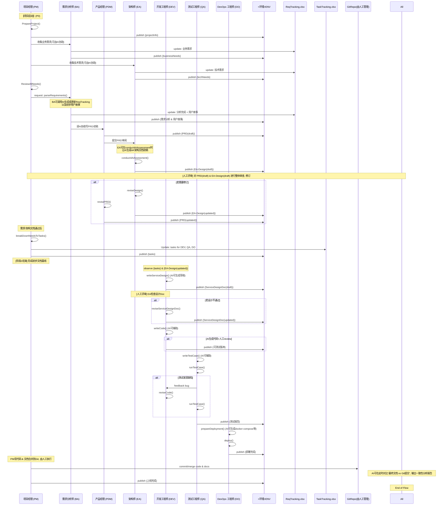

---

# AICO-Meta：基于多智能体的企业级软件研发框架（**整合更新版**）

## 1. AICO-Meta 的定位

- **AICO-Meta** 并不是一个需要开发的具体业务系统，而是一个 **多智能体协同** 的 **企业级软件研发流程框架**。  
- 框架通过配置各关键角色（如项目经理/PM、需求分析师/BA、产品经理/PDM、架构师/EA、开发/DEV、测试/QA、DevOps/DO 等）的 **SOP（标准作业流程）**，并结合 **LLM（大模型）** 或 **MetaGPT Agent** 提升角色的决策、文档生成、代码编写等能力，以 **规范并加速** 软件开发项目。

在此框架中，团队可灵活选择：  
- “**真人角色 + Agent**” 协同；  
- “**全自动 Agent**” 接管部分环节；  
- 或纯粹人工流程（仅参考框架定义的 SOP 及文档模板）。

---

## 2. 分阶段实现规划 (P0 / P1 / P2)

AICO-Meta 的落地一般分为三个阶段，便于在不同企业环境中循序渐进：

1. **P0：最小可用闭环**  
   - 搭建基础角色（BA、PDM、EA、DEV、QA、DO、PM），实现从需求到上线的**最小闭环**。  
   - 目标：当用户提出业务/技术需求后，可完成一次“需求→设计→实现→测试→部署”的端到端流程。

2. **P1：增强阶段**  
   - 在 P0 的基础上，引入**项目管理能力**（项目阶段、自动化评审流程、CI/CD、回归测试等）。  
   - 目标：**提升研发效率与质量**，减少人工重复操作，让各角色之间更**高度协同**。

3. **P2：高级阶段**  
   - 加入更多高级功能，如可观测性、性能/安全测试、用户反馈闭环等。  
   - 目标：**支撑中大型企业软件交付**的完整流程，并能持续演进。

---

## 3. 角色与关键能力：分阶段说明

| 角色名称           | 核心业务能力 (Key Abilities)                                                                                                                                                     | 分阶段实现 (P0/P1/P2)                                                              |
| ------------------ | ------------------------------------------------------------------------------------------------------------------------------------------ | ----------------------------------------------------------------------------------- |
| **项目经理 (PM)**  | - *端到端需求管理* <br> - `PrepareProject()`, `ReviewAllNeeds()`, `breakDownNeedsToTasks()`<br> - `writeTasks()`, `assignTask()`<br> - 项目进度、风险管理、资源协调             | **P0**：最基本的需求到上线流程<br>**P1**：项目阶段管理、复盘<br>**P2**：多项目、多团队管理 |
| 需求分析师 (BA)    | - `parseRequirements()` 收集业务需求<br> - 确定优先级、用户故事拆解<br> - 负责4A中的**业务架构**<br> - 更新《需求跟踪表》(ReqTracking)                                               | **P0**：撰写需求<br>**P1**：持续需求沟通<br>**P2**：复杂业务建模                                     |
| 产品经理 (PDM)     | - `writePRD()`, `revisePRD()`<br> - 定义验收标准<br> - 收集用户反馈并改进                                                                                                       | **P0**：撰写初版PRD<br>**P1**：多轮迭代<br>**P2**：用户反馈闭环                                    |
| 架构师 (EA)        | - `reviewPRD()`, `writeDesign()`, `reviseDesign()`<br> - `conduct4AAssessment()` (4A：应用/数据/技术/安全)<br> - 评审核心代码，**系统级/跨微服务架构**设计                        | **P0**：基础架构设计<br>**P1**：完善评审流程<br>**P2**：性能、安全、扩展性优化                                 |
| 开发工程师 (DEV)   | - `writeServiceDesign()`：微服务详细设计文档 (在 4A 架构之后，代码实现之前)<br> - `writeCode()`, `reviewCode()`, `reviseCode()`, `debugReflection()`<br> - 输出可运行代码、修复缺陷      | **P0**：实现核心功能<br>**P1**：自动化单测、Review<br>**P2**：持续重构、性能优化                                  |
| 测试工程师 (QA)    | - `writeTestCase()`, `runTestCase()`<br> - 自动化回归测试、测试报告<br> - 性能、安全、兼容性测试                                                                                   | **P0**：功能测试<br>**P1**：自动化回归<br>**P2**：性能/安全/兼容测试                                |
| DevOps 工程师 (DO) | - `prepareDeployment()`, `deploy()`<br> - 搭建 CI/CD<br> - **环境配置、监控、日志分析**<br> - **结合 4A 技术需求，对部署环境持续更新 (如中间件 Docker Compose)**             | **P0**：基础环境、部署<br>**P1**：CI/CD 自动化<br>**P2**：可观测性、容器化、告警体系                               |

> **说明**：在 4A 架构评审后，如果需要新增中间件（Redis、MQ、ElasticSearch 等），则由 **DevOps 工程师 (DO)** 在部署环境中做相应更新（如 Docker Compose、CI/CD 配置等）。

---

## 4. 整体流程：需求跟踪 → 用户故事 → 任务拆解

典型的需求实现流程如下：

1. **需求跟踪 (Requirement Tracking)**  
   - BA、EA 分别负责记录业务需求与技术需求，写入 ReqTracking.xlsx。  
2. **用户故事 (User Stories)**  
   - BA/PDM 将业务需求拆解为用户故事 (Story)；EA 若有技术需求，也可转化为技术故事或技术任务。  
3. **任务拆解 (Task Decomposition)**  
   - PM 根据用户故事拆解为更小的开发/测试/部署任务，放在 TaskTracking.xlsx 中，分配给相应角色。

对大型项目，可进一步扩展到 EPIC → Feature → Story → Task → Subtask 等多层结构。

---

## 5. 详细时序与信息流 (P0 阶段)

在 **P0** 阶段，可以将整个过程细分为两个主要环节：  
1. **需求分析阶段**：产出并评审需求/设计文档；  
2. **需求实现阶段**：产出并评审具体实现(代码、测试、部署)，最后上线。  

为辅助说明，下面给出一个**时序图**示例，展示从需求收集到微服务架构设计，再到编码、测试、部署的完整闭环，并在关键节点上体现“AI 辅助生成”+“人工评审修订”这两步。



**要点**：

- **需求分析阶段**(蓝色高亮处)：BA/PDM/EA/PM 等主要关注需求、PRD、架构文档的编写与评审；  
- **需求实现阶段**(粉色高亮处)：DEV/QA/DO 主要聚焦微服务设计文档、编写代码、测试用例、部署脚本等。  
- 整个流程保持“**AI 先产出，人工后修订**”模式，减少人工重复劳动，但**保留 20%~30%**的人工复核，以确保文档/代码可用度。  
- 最后可由 AI 做一次**文档 & 代码一致性**检查，人工决定是否更新文档或代码。

---

## 6. 各角色 Action 定义 & Observe/Publish

本节列出各角色常见的 Action，与其 Observe/Publish 机制。**在本次更新中，我们强调可以在这些 Action 中嵌入 AI 生成文档/代码**的步骤，并留出人工评审环节。

### 6.1 项目经理 (PM)

- **Action**  
  1. `PrepareProject()`  
     - 初始化项目文档/表格 (ReqTracking.xlsx, TaskTracking.xlsx)  
     - 设置项目基础信息（名称、范围、阶段）  
     - Publish 项目信息 (如 `{projectInfo}`) 到 ENV  
  2. `ReviewAllNeeds()`  
     - 从 ENV 或 ReqTracking 中获取业务需求、技术需求，审阅优先级与可行性  
  3. `breakDownNeedsToTasks()`  
     - 读取用户故事 (UserStories) 并拆解成具体开发/测试/部署的任务  
     - Update TaskTracking (TaskTracking.xlsx)  
  4. `writeTasks()`, `assignTask()`（可视为更细分的拆解/分配操作）

- **Observe**  
  - 当 BA/EA 发布 `{businessNeeds, techNeeds}` 时，PM 会进行 `ReviewAllNeeds()`  
  - 当文档更新（如 ReqTracking.xlsx）完成需求分析后，PM 也可 `observe` 到需求状态

- **Publish**  
  - `{projectInfo}`：初始化项目信息  
  - `{tasks}`：当任务分配完毕后发布任务列表  
  - `{上线完成}`：最终上线通知

### 6.2 需求分析师 (BA)

- **Action**  
  1. `parseRequirements()`  
     - 收集业务需求（与业务方访谈、问卷等），可让AI协助提炼要点  
     - 填写需求到 ReqTracking  
  2. `setPriority()`  
     - 根据业务价值、紧急程度等给需求排序  
  3. `createUserStories()`  
     - 将需求转换为用户故事 (User Story)  
  4. (在4A架构阶段) 更新 **业务架构** 相关内容

- **Observe**  
  - 当 PM 发起“需求收集”请求时，BA 开始调研并执行 `parseRequirements()`  
  - 当需要对需求进行分析与优先级排定时，BA 开始执行 `setPriority()`  
  - 当 EA 进行 4A 架构评审，需要业务架构部分信息

- **Publish**  
  - `{businessNeeds}`：BA 收集到的业务需求  
  - `{需求分析 & 用户故事}`：完成分析后

### 6.3 产品经理 (PDM)

- **Action**  
  1. `writePRD()`  
     - 根据 BA 的用户故事，撰写或修订 PRD（可由AI生成初稿）  
  2. `revisePRD()`  
     - 后续多轮迭代时，修订 PRD

- **Observe**  
  - 当 BA 发布了 `{需求分析 & 用户故事}` 时，PDM 即可创建/更新 PRD  
  - 当 EA 或其他角色反馈架构/设计更改时，也可触发 `revisePRD()`

- **Publish**  
  - `{PRD}`：完成 PRD 后发布  
  - `{需求确认}`：与 BA 交互或需求方确认

### 6.4 架构师 (EA)

- **Action**  
  1. `parseTechNeeds()`：收集/记录技术需求  
  2. `reviewPRD()`：检查PRD的技术可行性  
  3. `conduct4AAssessment()`：基于 4A(业务/数据/技术/应用/安全)进行架构评估(其中业务架构由BA完成或维护，EA需结合其余3层综合)  
  4. `writeDesign()`, `reviseDesign()`：输出EA-Design.md  
  5. `reviewServiceDesignDoc()`: 审核DEV的微服务设计文档

- **Observe**  
  - `{techNeeds}`, `{ServiceDesignDoc}`

- **Publish**  
  - `{4A架构设计完成}`, `{EA-Design.md}`, `{4A审查结果}`

### 6.5 开发工程师 (DEV)

- **Action**  
  1. `writeServiceDesign()`：微服务级详细设计文档 (ServiceX-Design.md)，**在 4A 完成后，编码之前**  
     - 可让AI根据 EA-Design.md 自动生成初稿，然后 DEV 修订  
  2. `writeCode()`：编写核心功能（AI 生成部分代码 + 人工审阅）  
  3. `reviewCode()`, `reviseCode()`: 代码自检、互检、修复  
  4. `debugReflection()`: 调试与优化

- **Observe**  
  - `{tasks}`, `{缺陷报告}`, EA 对设计文档的反馈

- **Publish**  
  - `{ServiceDesignDoc}`, `{可测试版本}`

### 6.6 测试工程师 (QA)

- **Action**  
  1. `writeTestCase()`: 编写测试用例（AI 可根据 PRD/Design 自动生成初稿）  
  2. `runTestCase()`: 执行测试，产出测试报告

- **Observe**  
  - `{tasks}`, `{可测试版本}`

- **Publish**  
  - `{缺陷报告}`, `{测试报告}`

### 6.7 DevOps 工程师 (DO)

- **Action**  
  1. `prepareDeployment()`: 准备部署环境（CI/CD、docker-compose 等），可由AI生成初版脚本  
  2. `deploy()`: 部署可上线版本

- **Observe**  
  - `{tasks}`, `{可测试版本}`, EA 的中间件变更需求

- **Publish**  
  - `{部署完成}`

---

## 7. P0 阶段 SOP 示范

结合**两大阶段**结构，示例如下：

1. **需求分析阶段**  
   - **PM**: `PrepareProject()`, `ReviewAllNeeds()`  
   - **BA**: `parseRequirements()`, `createUserStories()` (AI协助生成需求、用户故事)  
   - **PDM**: `writePRD()` (AI产出初稿 + 人工审核)  
   - **EA**: `reviewPRD()`, `conduct4AAssessment()`, `writeDesign()` (AI产出架构文档初稿 + 人工修订)  
   - **PM**: `breakDownNeedsToTasks()`(将已评审通过的需求拆解为任务)  

2. **需求实现阶段**  
   - **DEV**: `writeServiceDesign()` (AI生成服务设计文档初稿 + 人工评审)，`writeCode()`(AI生成部分代码 + 人工Review)  
   - **QA**: `writeTestCase()` (AI生成测试用例草稿 + 人工补充/执行)，`runTestCase()`  
   - **DO**: `prepareDeployment()`, `deploy()` (AI生成部署脚本 + 人工测试/修订)  
   - **PM**: 最终合并代码和文档到 Git，由人工管理版本  
   - (可选) **AI**: 对比“文档 vs 代码”生成一致性报告  
   - **PM**: `publish {上线完成}`

---

## 8. AICO-Meta 基于 MetaGPT 的实现清单

### 8.1 P0 阶段（最小可用闭环）

1. **核心角色扩展**  
   - 在 MetaGPT 中，为 PM、BA、PDM、EA、DEV、QA、DO 定义各自 `Role` 类；  
   - 实现最基础的 Action (如 `PrepareProject()`, `parseRequirements()`, `writeServiceDesign()`, `writeCode()`, etc.)。  

2. **消息机制**  
   - 建立 `ENV` 作为消息总线；  
   - 角色完成 Action 后 `publish(...)`，其它角色 `observe(...)` 获取并处理。  

3. **文档模板**  
   - ReqTracking.xlsx, TaskTracking.xlsx, PRD, EA-Design.md, ServiceX-Design.md, Testcase-Design.md, Deployment.md 等，均可在角色执行 Action 时自动生成或更新。  
   - 在“AI+人机协同”模式下，可由 AI 先生成初稿，人工再修订并发布最终版。

4. **最小工作流**  
   - 需求收集 → 用户故事 → 架构设计 → 微服务设计 → 开发 → 测试 → 部署  
   - 对应的关键角色 SOP 已在前文列出。

### 8.2 后续阶段（P1 / P2）

1. **P1：增强**  
   - 项目阶段管理 (`setPhases()`)、自动化评审、CI/CD、自动化回归测试等  
   - 让更多日常操作自动化，减少人工干预。  

2. **P2：高级**  
   - 性能/安全测试、容器化、监控告警、一键回滚、用户反馈分析等  
   - 多团队协作、多项目管理  
   - 进一步提高 AI 自动化水平，如自动合并代码、自动回滚等。

---

## 9. 改进与后续扩展

### 9.1 中间件需求与 DevOps 更新

- 为了更好地跟踪中间件变更（如新增 Redis、MQ、ES 等），可在 `TaskTracking.xlsx` 中建立“**环境变更**”或“**中间件更新**”类型的任务。  
- 流程示例：  
  1. EA 在 4A 架构评审中提出或更新中间件需求；  
  2. PM 将该需求转为“环境变更任务”分配给 DO；  
  3. DO 更新 Docker Compose、CI/CD 脚本；  
  4. QA 执行环境验证测试（可加入到测试用例或单独一份部署验证脚本中）；  
  5. 更新完毕后在 `TaskTracking.xlsx` 中标记完成。

### 9.2 各阶段产出物规范

以下为各常见文档及其建议内容，尤其针对 **EA-Design.md** 与 **Service-Level-Design** 做了更详细说明。

1. **ReqTracking.xlsx**  
   - 记录业务/技术需求，如需求ID、需求类型(业务/技术)、优先级、状态(新建、分析中、已完成等)、对应用户故事、备注等。  
   - BA、EA 分别维护业务/技术需求，并在需求分析后更新状态。

2. **TaskTracking.xlsx**  
   - 列出具体任务，如 任务ID、任务类型(开发、测试、环境变更等)、负责人、状态(未开始/进行中/已完成)、起止时间、关联用户故事ID 等。  
   - 由 PM 创建并跟踪，DEV/QA/DO 在此更新进度或完成度。

3. **PRD (Product Requirement Document)**  
   - Typically 由 PDM 编写，主要涵盖：  
     - 背景和目标  
     - 用户故事 (BA 提供)  
     - 功能清单/验收标准  
     - 产品原型(如果需要)  
   - 在 P1/P2 时可扩展多轮迭代/版本管理。

4. **EA-Design.md（系统级/跨微服务的高阶设计文档）**  
   - **整体微服务拓扑图**：罗列所有服务与其职责边界、接口调用关系、数据流走向。  
   - **关键非功能特性**：高可用、容灾、弹性伸缩、网关/负载均衡方案等。  
   - **技术框架选型**：语言、通信协议（REST/gRPC）、中间件(缓存/队列)等。  
   - **4A 架构**：  
     - 业务架构(BA 提供/确认整体流程)  
     - 数据架构(数据库拆分、中心 DB vs. 各微服务独立 DB)  
     - 技术架构(服务框架、通信模式、消息队列、CI/CD 等)  
     - 应用架构(服务边界、API 级别描述、安全/权限模型)  
   - **目标**：让团队对整个系统的全局宏观结构一目了然。

5. **Service-Level-Design (如 `ServiceX-Design.md`)**  
   - **各微服务的详细设计**，由 DEV 或对应服务负责人编写、EA 评审：  
     - **功能/模块拆分**：该服务具体提供哪些业务功能？  
     - **数据库设计**：表结构、索引、分区策略(若有)等。  
     - **接口定义**：对外暴露 API (REST/gRPC)、消息格式、错误码等。  
     - **内部业务流程**：核心逻辑、状态机、异常处理；是否需要缓存/熔断/重试机制。  
     - **性能/故障考虑**：是否需负载均衡、限流、日志监控等。  
   - **目标**：对每个微服务的内部实现细节进行更深入的设计和记录，保持与 EA-Design.md 的整体架构一致。

6. **Testcase-Design.md**  
   - QA 编写：列出功能/回归/压力等测试用例；描述用例步骤、期望结果、实际结果。  
   - 在 P1/P2 可扩展自动化测试脚本、覆盖率分析等。

7. **Deployment.md**  
   - 由 DO 编写：记录环境拓扑、Docker Compose 示例、CI/CD 流程说明。  
   - 如果架构变更（新增 Redis、MQ），也要同步更新本文档，便于后续维护。

### 9.3 迭代管理 & 敏捷实践

- 在 P0 中主要跑通最小闭环；  
- P1/P2 若采用 Scrum，可加上 Sprint 规划、看板、燃尽图、每日站会、迭代回顾等；  
- 用户故事/任务可与 Jira/Trello/Confluence 等工具结合，进行 Backlog 管理和持续迭代。

### 9.4 在 MetaGPT 中的执行：API/消息结构 & 函数签名

- **基础概念**：  
  - `ENV`：一个全局消息总线或共享上下文；  
  - 每个 `Role` 可以在自己的类中定义 Action 方法，并通过 `observe`/`publish` 函数与 `ENV` 交互；  

- **示例函数签名**：
  ```python
  class ProjectManager(Role):
      def prepare_project(self, project_info: dict) -> None:
          """
          Action: 初始化项目文档并发布项目信息到 ENV。
          :param project_info: 包含项目名称、范围、阶段等信息
          :return: None
          """
          # ...具体逻辑...
          self.publish("projectInfo", project_info)

      def review_all_needs(self) -> None:
          """
          Action: 审阅全部业务/技术需求，合并到ENV 或内部状态。
          """
          # observe from ENV
          needs = self.observe("businessNeeds") + self.observe("techNeeds")
          # ...处理合并/优先级判断...

      def break_down_needs_to_tasks(self) -> None:
          """
          Action: 将用户故事等需求拆解为任务，并发布到ENV。
          """
          user_stories = self.observe("userStories")
          # ...拆解逻辑...
          self.publish("tasks", tasks_list)
  ```
  - 其中 `self.observe("type")` 表示从 `ENV` 中获取特定类型消息；`self.publish("type", payload)` 表示往 `ENV` 中发布消息；  
  - 实际实现可根据 MetaGPT 的具体接口进行调整。

- **其余角色**：  
  - 在自己的方法中进行 `observe`(监听)、`publish`(输出)；  
  - 通过**文档生成/更新**API（如 `generate_doc()`）来维护 ReqTracking.xlsx、EA-Design.md 等；  
  - 在需要时可调用 AI 做“自动补全/生成”，再由人工或其他角色评审确认。

- **消息结构**：  
  - 通常可采用 `{"type": "businessNeeds", "payload": {...}}` 的 JSON 格式，也可更复杂；  
  - 在 P0 阶段不必过度复杂，只需确认每种类型(`businessNeeds`, `techNeeds`, `PRD`, `tasks`, `可测试版本`等) 对应的数据结构即可。

---

## 10. 参考资料

- [MetaGPT 官方文档](https://metagpt.readthedocs.io/en/latest/)  
- [MetaGPT 示例项目](https://github.com/OpenBMB/MetaGPT)  
- [MetaGPT 源码](https://github.com/OpenBMB/MetaGPT)

---

## 11. 端到端一致性复核（可选增强）

在完成 **需求分析阶段** 与 **需求实现阶段** 后，为了确保**文档与代码**不存在偏差，可让 AI 对比：

1. **Git 提交记录**（代码改动）与**最终文档**(PRD, EA-Design, Service-Level-Design 等)之间的差异；  
2. 若 AI 发现明显冲突或未更新文档之处，则输出一个差异报告；  
3. 由 **PM/EA/DEV 等**进行人工决策，**是否**要修订文档或进行代码回退/调整；  
4. 形成最终一致的 **上线基线**。  

在 P0 初期，此步骤可采用**人工**查看或简单脚本进行；在 P1/P2 阶段再与更多自动化工具（如 CI/CD、变更审计）结合，构建**更高自动化**的一致性审查流程。
