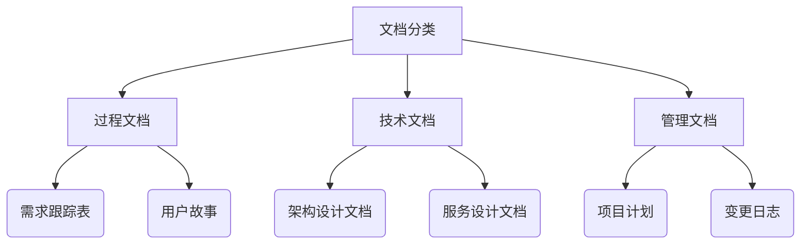

# AICO 文档与版本管理规范

## 1. 文档体系概览


## 2. 核心文档规范

### 2.1 项目跟踪表 (ProjectTracking.xlsx)
- **路径**：`{project_root}/tracking/ProjectTracking.xlsx`
- **内容规范**：
  ```markdown
  1. 原始需求表：
     - 需求文件路径 | 需求类型 | 提交时间 | 状态 | 关联需求ID | BA解析时间 | EA解析时间 | 完成时间 | 备注
  
  2. 需求管理表：
     - 需求ID | 标题 | 类型 | 优先级 | 状态 | 负责人 | 用户故事ID | 关联文档路径
  
  3. 用户故事表：
     - 故事ID | 标题 | 状态 | 验收标准 | 关联任务 | 完成时间
  ```
- **版本规则**：随Git提交自动更新，不单独版本化

### 2.2 架构设计文档 (EA-Design.md)
- **路径**：`{project_root}/docs/ea/architecture_vX.Y.md` （X.Y为主次版本）
- **内容规范**：
  ```markdown
  # 架构设计文档（版本：vX.Y）
  
  ## 1. 业务架构
  - 战略目标
  - 业务流程（Mermaid图）
  
  ## 2. 应用架构
  - 微服务拓扑图
  - 接口规范
  
  ## 3. 数据架构
  - ER图
  - 数据治理策略
  
  ## 4. 技术架构
  - 技术选型表
  - 部署架构图
  ```
- **版本规则**：主版本变更时新建文件（如v2.0），次版本更新在原文件

### 2.3 用户故事文档
- **路径**：`{project_root}/docs/requirements/user_stories_vX.Y.Z.md`
- **内容规范**：
  ```markdown
  # 用户故事（版本：vX.Y.Z）
  
  ## 标准需求 SR-001
  ### US-001 用户登录
  **状态**：已完成  
  **验收标准**：
  - 支持手机号+验证码登录
  - 失败时显示友好提示
  
  ### US-002 权限管理
  ...
  ```
- **版本规则**：每次需求基线更新生成新文件

## 3. 版本管理机制

### 3.1 版本号格式
- **语义化版本**：`主版本.次版本.修订版本` (SemVer)
- **示例**：`1.1.1`
  - `1`：主版本（架构变更）
  - `1`：次版本（需求基线）
  - `1`：修订版本（问题修复）

### 3.2 版本变更规则
| 变更类型         | 版本递增 | 触发条件                  | 文档影响                     |
|------------------|----------|--------------------------|----------------------------|
| 架构重大变更      | 主版本+1 | 技术栈更换、服务拆分       | 新建EA-Design_vX.0.md       |
| 需求基线更新      | 次版本+1 | 累计5个用户故事完成        | 新建user_stories_vX.Y.md    |
| 紧急修复          | 修订版本+1 | 生产环境关键BUG修复       | 更新原用户故事文件            |

### 3.3 基线创建流程
```mermaid
sequenceDiagram
    participant PM as PM
    participant Git as Git
    participant FS as 文件系统
    
    PM->>PM: 完成需求分析
    PM->>Git: git tag -a v1.1.0 -m "需求基线"
    Git-->>FS: 创建标签
    PM->>FS: 生成docs/releases/v1.1.0/
    FS-->>PM: 包含：
        USER_STORIES.md
        ARCH.md
        CHANGELOG.md
```

## 4. 规范文件（SPEC）管理

### 4.1 规范文件列表
| 规范名称             | 文件路径                          | 作用范围         |
|----------------------|----------------------------------|------------------|
| 架构设计规范         | docs/specs/ea_design_spec.md     | 所有技术文档      |
| 用户故事规范         | docs/specs/user_story_spec.md    | 需求相关文档      |
| 版本管理规范         | docs/specs/version_spec.md       | 全项目           |

### 4.2 规范更新规则
1. **变更触发**：
   - 架构调整 → 修改ea_design_spec.md
   - 流程优化 → 修改version_spec.md
2. **版本关联**：
   ```markdown
   > 本规范更新于：2024-02-20  
   > 适用版本：v1.1+  
   > 对应标签：[spec-update-202402]
   ```
3. **兼容性要求**：新规范需向下兼容至少两个次版本

## 5. 文档评审流程

### 5.1 三次基线评审
1. **需求基线评审**：
   - 检查点：需求跟踪表 vs 用户故事文档
   - 输出：需求基线版本（vX.Y.0）

2. **设计基线评审**：
   - 检查点：架构设计 vs 用户故事
   - 输出：设计基线版本（vX.Y.0）

3. **实现基线评审**：
   - 检查点：代码 vs 设计文档
   - 输出：发布版本（vX.Y.Z）

### 5.2 自动化检查
```python
def check_doc_consistency():
    """文档一致性检查"""
    # 1. 验证用户故事ID在跟踪表中存在
    stories = load_user_stories()
    for story in stories:
        if not tracking_table.has_story(story.id):
            raise ValidationError(f"故事{story.id}未登记")
    
    # 2. 验证架构文档中的服务与代码匹配
    services = load_arch_services()
    for svc in services:
        if not codebase.has_service(svc):
            raise ValidationError(f"服务{svc}未实现")
```

## 6. 附录：版本演进示例

### v1.0.0 → v1.1.0 → v1.1.1
1. **v1.0.0**：
   ```bash
   docs/
   ├── ea/
   │   └── architecture_v1.0.md
   └── requirements/
       └── user_stories_v1.0.0.md
   ```

2. **v1.1.0**：
   ```bash
   docs/
   ├── releases/
   │   └── v1.1.0/
   │       ├── USER_STORIES.md    # 聚合故事
   │       └── ARCH.md           # 架构摘要
   └── requirements/
       └── user_stories_v1.1.0.md # 新增5个故事
   ```

3. **v1.1.1**：
   ```bash
   docs/
   └── requirements/
       └── user_stories_v1.1.1.md  # 修复故事US-005验收标准
   ```

## 规范兼容性复核

### 与EA设计规范（ea_design_spec.md）的兼容性
- ✅ 版本表要求：通过Git标签信息可提取
- ✅ 变更说明：通过标签message字段实现
- ⚠️ 需补充：在"7. 格式检查清单"增加：
  ```text
  [√] Git标签与版本文件一致
  [√] 发布包包含必要文档
  ```

### 与用户故事规范（user_storys_sepc.md）的兼容性
- ✅ 版本命名规则：保持语义化版本一致
- ⚠️ 需调整：原"文件命名规则"改为：
  ```markdown
  文件名：`{项目ID}_user_stories_vX.Y.Z.md` 应存放于：
  docs/releases/vX.Y.Z/USER_STORIES.md
  ```
- ✅ 版本保留策略：通过Git历史记录实现

## 后续改进建议
1. 在CI/CD流程中添加版本校验步骤：
   ```bash
   # 检查标签与VERSION文件一致性
   git tag --contains $(git rev-parse HEAD) | grep v$(cat VERSION)
   ```
2. 增加版本变更看板（示例）：
   ```mermaid
   gantt
       title 版本演进路线
       section v1.x
       v1.0.0 : 2024-01-01, 7d
       v1.1.0 : 2024-02-01, 5d
       v1.1.1 : 2024-02-15, 2d
   ``` 