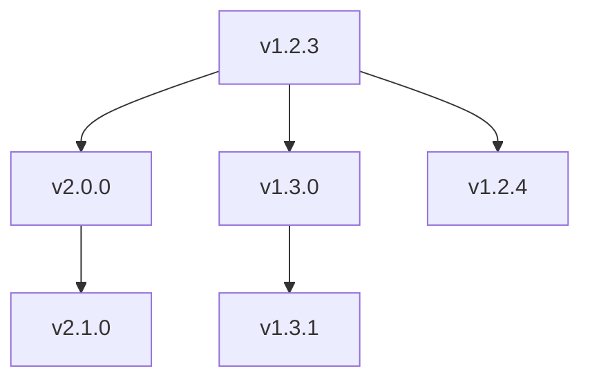

# AICO 文档管理和版本管理规范

## 1. 各角色核心产出物

### 1. 项目经理（PM）
| 产出物                | 文件路径                          | 内容规范                     | 版本规则         |
|-----------------------|----------------------------------|----------------------------|------------------|
| 项目跟踪表            | `tracking/project_tracking.xlsx`  | 需求-任务-缺陷跟踪矩阵       | 持续更新          |
| 版本规划文件          | `VERSION`                        | 下一基线版本号               | 随需求分析更新    |
| 管理规范文档          | `docs/specs/pm_guide.md`         | 版本管理、会议纪要模板等      | 主版本变更时更新  |
| 管理规范文档          | `docs/specs/ba_guide.md`         | 需求分析规范等      | 主版本变更时更新  |
| 管理规范文档          | `docs/specs/ea_guide.md`         | 企业架构规范等      | 主版本变更时更新  |
| 管理规范文档          | `docs/specs/prd_guide.md`         | 产品设计规范等      | 主版本变更时更新  |
| 管理规范文档          | `docs/specs/dev_guide.md`         | 开发规范等      | 主版本变更时更新  |
| 管理规范文档          | `docs/specs/qa_guide.md`         | 测试规范等      | 主版本变更时更新  |
| 原始需求管理         | `docs/requirements/raw`         | 原始需求文档      | 持续更新  |

### 2. 业务分析师（BA）
| 产出物                | 文件路径                          | 内容规范                     | 版本规则         |
|-----------------------|----------------------------------|----------------------------|------------------|
| 业务架构文档          | `docs/ea/biz_arch/vX.Y/biz_arch.md` | 业务能力矩阵、流程图         | 次版本变更时更新  |
| 需求分析报告          | `docs/requirements/analyzed/vX.Y/req-{ID}/biz_analysis.md` | 包含需求说明和用户故事       | 每个需求独立更新  |

### 3. 架构师（EA）
| 产出物                | 文件路径                          | 内容规范                     | 版本规则         |
|-----------------------|----------------------------------|----------------------------|------------------|
| 技术架构文档          | `docs/ea/tech_arch/vX.Y/tech_arch.md` | 技术栈、组件图、ADR       | 主版本变更时更新  |
| 需求分析报告          | `docs/requirements/analyzed/vX.Y/req-{ID}/tech_analysis.md` | 包含需求说明       | 每个需求独立更新  |


### 4. 产品经理（PRD）
| 产出物                | 文件路径                          | 内容规范                     | 版本规则         |
|-----------------------|----------------------------------|----------------------------|------------------|
| 产品设计文档          | `docs/design/prd/vX.Y/prd.md` | 产品设计文档     | 主版本变更时更新    |


### 4. 开发工程师（DEV）
| 产出物                | 文件路径                          | 内容规范                     | 版本规则         |
|-----------------------|----------------------------------|----------------------------|------------------|
| 服务设计文档          | `docs/design/services/{服务}/vX.Y/service_design.md` | 模块设计、类图     | 服务变更时更新    |
| 接口实现规范          | `docs/design/services/{服务}/vX.Y/api_spec.yaml` | 基于模板的具体接口   | 随接口变更更新    |

### 5. 测试工程师（QA）
| 产出物                | 文件路径                          | 内容规范                     | 版本规则         |
|-----------------------|----------------------------------|----------------------------|------------------|
| 测试用例文档          | `docs/design/tests/{服务}/vX.Y/test_cases.md` | 测试场景、数据准备步骤 | 随服务版本更新    |
| 测试报告              | `releases/vX.Y.Z/qa_report.md`   | 测试结果汇总                 | 每个发布版本生成  |

## 2. 目录结构规范

```bash
project_root/
├── VERSION                  # 版本定义
├── tracking/
│   └── project_tracking.xlsx # 项目跟踪表
├── docs/
│   ├── specs/               # 规范文档
│   │   ├── pm_guide_spec.md      # 项目管理规范
│   │   ├── ba_guide_spec.md      # 需求分析规范
│   │   ├── ea_guide_spec.md      # 企业架构规范
│   │   ├── dev_guide_spec.md      # 开发规范
│   │   ├── prd_guide_spec.md      # 产品设计规范
│   │   └── qa_guide_spec.md      # 测试规范
│   │   └── api_template_spec.yaml# 接口模板
│   │
│   ├── requirements/        # 需求管理
│   │   ├── raw/             # 原始需求
│   │   ├── analyzed/vX.Y.Z/        # 已分析需求
│   │   │   └── req-101/        # 需求101
│   │   │       └── biz_analysis.md  # 需求说明和用户故事
│   │   │       └── tech_analysis.md  # 技术分析
│   │
│   ├── ea/                  # 企业架构
│   │   ├── biz_arch/vX.Y.Z/        # 业务架构
│   │   │   └── biz_arch.md  # 业务架构
│   │   └── tech_arch/vX.Y.Z/       # 技术架构
│   │   │   └── tech_arch.md  # 技术架构
│   │
│   └── design/              # 设计文档
│       ├── prd/vX.Y.Z/             # 产品设计
│       │   └── prd.md  # 产品设计
│       ├── services/vX.Y.Z/        # 服务设计
│       │   └── service_design.md  # 服务设计
│       │   └── api_spec.yaml  # 接口规范
│       └── tests/vX.Y.Z/           # 测试方案
│       │   └── test_cases.md  # 测试用例
│       │   └── test_report.md  # 测试报告
└── releases/                # 发布版本
    └── vX.Y.Z/             # 交付包
        
```


## 3. 版本变更用例

### 用例1：主版本升级（v1.2.3 → v2.0.0）
**需求背景**：新增库存服务，实现商品库存的独立管理，需要重构现有架构：
- 业务影响：新增库存管理流程，调整商品-订单交互机制
- 技术变更：引入新的微服务，更新服务间通信协议
- 关联模块：订单服务、商品服务

```bash
docs/
├── ea/
│   ├── biz_arch/
│   │   ├── v1.2.3/       # 保留旧版本
│   │   └── v2.0.0/       # 新建业务架构
│   └── tech_arch/
│       ├── v1.2.3/       # 保留旧版本
│       └── v2.0.0/       # 新建技术架构
docs/requirements/
│   ├── analyzed/
│   │   ├── v1.2.3/       # 旧需求
│   │   └── v2.0.0/       # 新需求分析
releases/
    └── v2.0.0/           # 新建发布目录
```
变化点：业务/技术架构重构，需求分析目录新建版本，生成迁移指南

### 用例2：次版本升级（v1.2.3 → v1.3.0）
**需求背景**：在商品服务中增加批次管理模块，实现生产批次追溯：
- 业务影响：扩展商品管理能力，新增批次属性字段
- 技术变更：在现有服务中增加子模块，扩展数据库表结构
- 关联模块：商品基础服务、仓储服务

```bash
docs/requirements/
│   ├── analyzed/
│   │   ├── v1.2.3/       # 保留旧需求
│   │   └── v1.3.0/       # 新增需求分析
docs/ea/
│   └── biz_arch/
│       └── v1.3.0/       # 更新业务架构
releases/
    └── v1.3.0/           # 新建发布目录
```
变化点：新增需求分析目录，业务架构文档更新，技术架构保持不变

### 用例3：修订版本升级（v1.2.3 → v1.2.4）
**需求背景**：修复商品档案查询缺少品牌字段的缺陷：
- 业务影响：完善商品信息展示完整性
- 技术变更：扩展接口返回字段，更新数据库查询逻辑
- 关联模块：商品服务前端、API网关

```bash
releases/
    ├── v1.2.3/           # 保留旧版本
    └── v1.2.4/           # 新建修复版本
        └── qa_report.md  # 更新测试报告
docs/design/
    └── tests/
        └── v1.2.4/       # 新增测试用例
```
变化点：仅更新测试相关目录，生成缺陷修复报告，架构文档保持不变

## 4. 典型需求版本变更对比

### 通用初始状态（v1.2.3）
```bash
project_root/
├── VERSION                    # v1.2.3
├── tracking/
│   └── project_tracking.xlsx  # 无三个用例记录
├── docs/
│   ├── specs/
│   │   ├── pm_guide_spec.md
│   │   └── api_template_spec.yaml
│   ├── requirements/
│   │   ├── raw/               # 空目录
│   │   └── analyzed/v1.2.3/   # 已有req-101~103
│   ├── ea/
│   │   ├── biz_arch/v1.2.3/
│   │   │   └── biz_arch.md    # 无库存/批次流程
│   │   └── tech_arch/v1.2.3/
│   │       └── tech_arch.md   # 无库存服务
│   └── design/
│       ├── prd/v1.2.3/prd.md
│       ├── services/
│       │   └── product/v1.2.3/
│       │       ├── service_design.md  # 无批次模块
│       │       └── api_spec.yaml      # 无品牌字段
│       └── tests/v1.2.3/
│           └── test_cases.md          # 基础用例
└── releases/
    └── v1.2.3/
        └── qa_report.md       # 初始报告
```

### 4.1 主版本升级案例（v2.0.0）
**需求背景**：新增库存服务，实现商品库存的独立管理，需要重构现有架构：
- 业务影响：新增库存管理流程，调整商品-订单交互机制
- 技术变更：引入新的微服务，更新服务间通信协议
- 关联模块：订单服务、商品服务

```bash
project_root/
├── VERSION                    🆕 v2.0.0
├── tracking/
│   └── project_tracking.xlsx  📝 新增需求201记录
├── docs/
│   ├── requirements/
│   │   ├── raw/
│   │   │   └── req-201-inventory.md 🆕
│   │   └── analyzed/
│   │       └── v2.0.0/       🆕
│   │           └── req-201/
│   │               ├── biz_analysis.md 🆕
│   │               └── tech_analysis.md 🆕
│   ├── ea/
│   │   ├── biz_arch/v2.0.0/biz_arch.md 📝
│   │   └── tech_arch/v2.0.0/tech_arch.md 📝
│   └── design/
│       ├── prd/v2.0.0/prd.md 🆕
│       └── services/
│           └── inventory/v2.0.0/ 🆕
│               ├── service_design.md 🆕
│               └── api_spec.yaml 🆕
└── releases/
    └── v2.0.0/               🆕
        ├── qa_report.md       🆕
        └── migration_guide.md 🆕
```

### 4.2 次版本升级案例（v1.3.0）
**需求背景**：在商品服务中增加批次管理模块，实现生产批次追溯：
- 业务影响：扩展商品管理能力，新增批次属性字段
- 技术变更：在现有服务中增加子模块，扩展数据库表结构
- 关联模块：商品基础服务、仓储服务

```bash
project_root/
├── VERSION                    📝 v1.3.0
├── tracking/
│   └── project_tracking.xlsx  📝 新增需求202记录
├── docs/
│   ├── requirements/
│   │   └── analyzed/v1.3.0/   🆕
│   │       └── req-202/
│   │           ├── biz_analysis.md 🆕
│   │           └── tech_analysis.md 🆕
│   ├── ea/
│   │   └── biz_arch/v1.3.0/biz_arch.md 📝
│   └── design/
│       ├── prd/v1.3.0/prd.md 🆕
│       └── services/
│           └── product/v1.3.0/ 🆕
│               └── batch_module/ 🆕
│                   ├── service_design.md 🆕
│                   └── api_spec.yaml 🆕
└── releases/
    └── v1.3.0/               🆕
        └── qa_report.md       🆕
```

### 4.3 修订版本升级案例（v1.2.4）
**需求背景**：修复商品档案查询缺少品牌字段的缺陷：
- 业务影响：完善商品信息展示完整性
- 技术变更：扩展接口返回字段，更新数据库查询逻辑
- 关联模块：商品服务前端、API网关

```bash
project_root/
├── VERSION                    📝 v1.2.4
├── tracking/
│   └── project_tracking.xlsx  📝 更新需求203状态
├── docs/
│   ├── requirements/
│   │   └── analyzed/v1.2.4/   🆕
│   │       └── req-203/
│   │           └── biz_analysis.md 🆕
│   └── design/
│       ├── services/
│       │   └── product/v1.2.4/api_spec.yaml 📝
│       └── tests/v1.2.4/       🆕
│           └── test_cases.md 📝
└── releases/
    └── v1.2.4/               🆕
        ├── qa_report.md       🆕
        └── patch_notes.md     🆕
```

### 4.4 变更跟踪对比
| 需求ID | 需求简述                 | 变更前状态 | 变更后状态 | 版本影响 |
|--------|--------------------------|------------|------------|----------|
| 201    | 库存服务架构升级         | 未跟踪     | 已发布     | 主版本   |
| 202    | 商品批次管理模块         | 待分析     | 测试中     | 次版本   |
| 203    | 商品档案缺失品牌字段修复 | 待修复     | 已关闭     | 修订版本 |

### 4.5 版本演进路径

（注：通过目录版本号实现多版本并行维护）
