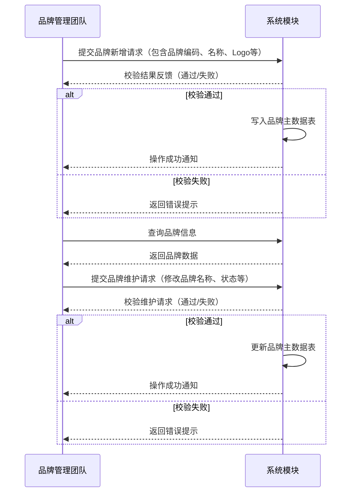
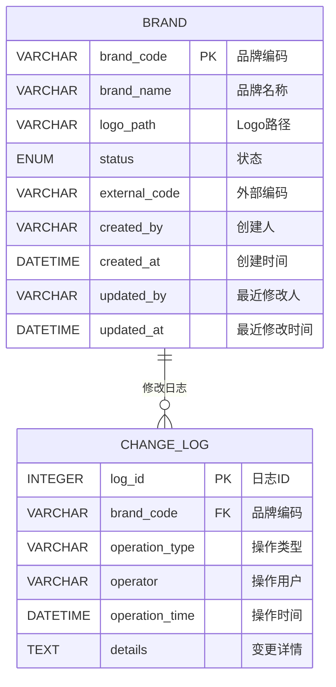
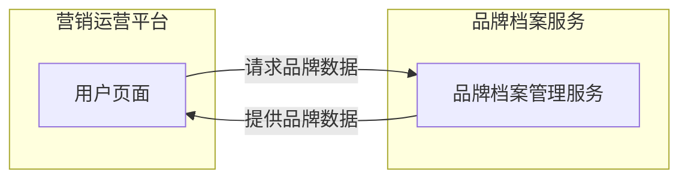

## 版本说明
 版本 | 日期       | 生成角色 | 变更说明                 |
|------|------------|----------|--------------------------|
| 1.0  | 2024-01-20 | EA       | 初版架构设计             |
| 1.1  | 2024-01-25 | BA       | 补充用户故事映射关系      |

## 1. 引言

### 1.1 项目背景

随着消费品行业的快速发展和竞争加剧，企业面临越来越复杂的供应链管理和多渠道运营挑战。为提高数字化能力，企业需要构建一套清晰的、可扩展的架构体系，以支持业务发展，提升运营效率，优化客户体验。

XXX作为行业领先的消费品公司，旨在通过4A架构（业务架构BA、数据架构DA、应用架构AA、技术架构TA）的设计，全面梳理当前的业务需求、数据流、应用系统和技术基础设施，支持核心模块的设计与迭代，包括品牌档案管理等，助力企业实现数字化转型。

### 1.2 目标与范围

**目标**  
1. 梳理消费品公司核心业务模块的架构体系，明确业务逻辑与功能边界。  
2. 设计清晰的系统交互流程和技术实现路径，支持快速部署和扩展。  
3. 提供实施规划和演进路线，确保项目落地的可行性与持续性。

**范围**  
1. 核心模块：目前聚焦品牌档案管理模块。  
2. 架构层次：覆盖业务架构（BA）、数据架构（DA）、应用架构（AA）、技术架构（TA）。  
3. 交付内容：包含业务流程、数据模型、系统功能边界及平台化指导原则。

### 1.3 方法论与参考标准

- **TOGAF** (The Open Group Architecture Framework)
- **BPMN** (Business Process Model and Notation)
- **敏捷开发方法**：快速响应需求变化并持续交付高质量的软件。

---

## 2. 业务架构（BA）

### 2.1 企业战略概述

XXX公司作为消费品行业的领导者，其战略目标包括：  
- 提升品牌价值，扩大市场覆盖面。  
- 优化渠道运营管理，实现从传统分销到终端直配的模式升级。  
- 通过数字化技术支持多渠道、多场景的业务协同。

业务架构将围绕这些战略目标，设计与之匹配的能力模块和流程框架。

### 2.2 业务能力模型

**主数据管理能力**  
- 品牌档案管理  

### 2.3 组织结构与角色职责

- **业务部门**  
  - 品牌管理团队：负责品牌档案的新增、维护和优化。

- **技术支持团队**  
  - 开发团队：负责系统的设计与开发。  
  - 运维团队：确保系统的稳定运行与技术支持。

- **外部协作角色**  
  - 供应商：提供品牌基础信息，与系统接口对接。

### 2.4 业务流程分析

#### 2.4.1 品牌档案管理流程

**核心场景说明**  
- **新增品牌档案**：品牌管理团队提交品牌基础信息，系统校验后存入品牌主数据表。  
- **维护品牌档案**：品牌管理团队根据业务需要修改品牌信息，系统完成更新并同步给相关模块。  
- **查询品牌档案**：用户通过查询接口获取品牌信息，用于后续商品关联或促销活动设计。

> 在品牌档案管理流程中，可进一步细化异常场景（如重复品牌编码、外部接口调用异常等），并加入相应的错误处理和告警机制。

### 2.5 用户故事映射
+| 故事ID | 需求来源（REQ-ID） | 业务流程节点 | 验收标准                 |
+|--------|--------------------|--------------|--------------------------|
| US-001 | REQ-BA-001         | 品牌信息提交 | 提交后1分钟内返回校验结果 |
| US-002 | REQ-BA-002         | 品牌状态变更 | 变更记录需包含操作人信息  |

---

## 3. 数据架构（DA）

### 3.1 数据域与数据分类

- **品牌主数据域**  
  核心字段：品牌编码、品牌名称、Logo路径、状态（启用/禁用）、外部编码、创建时间、创建人、最近修改人、最近修改时间。

- **数据日志管理**  
  每次数据变更需记录操作用户、变更时间及变更前后的具体内容，支持按品牌编码、时间范围等条件筛选日志记录。

### 3.2 数据模型

### 3.3 数据治理与管理

- **主数据管理**  
  确保品牌档案的唯一性和一致性，所有主数据表需统一包含以下标准字段：  
  - `created_by`  
  - `created_at` (格式 `YYYY-MM-DD HH:mm:ss`)  
  - `updated_by`  
  - `updated_at` (格式 `YYYY-MM-DD HH:mm:ss`)

- **修改日志管理**  
  每次对数据的新增、更新或删除操作均需记录日志，包含：操作类型（新增、更新、删除）、操作用户、操作时间、变更前后具体内容等。

- **数据权限控制**  
  不同用户角色仅可访问和操作特定字段，确保敏感数据安全。

---

## 4. 应用架构（AA）

### 4.1 应用架构概述

基于"轻前端、共享业务服务"的指导思想，品牌档案管理模块的应用架构设计如下：

- **轻前端**  
  通过简洁的用户界面，满足品牌管理团队对品牌信息的录入、查询和修改需求。  

- **共享业务服务**  
  - 品牌档案作为共享服务，提供统一的API接口，支持商品管理、订单管理等模块调用。  
  - 数据与服务集中管理，避免重复开发和数据冗余。

### 4.2 应用功能模块

#### 4.2.1 品牌档案模块

- **品牌信息管理**：支持品牌信息的新增、修改、查询操作。  
- **数据校验服务**：实现品牌信息的完整性和唯一性校验。  
- **数据同步服务**：将品牌档案变更同步至其他依赖模块（如商品管理）。

### 4.3 功能边界

- **品牌档案管理模块**  
  核心职责：提供品牌数据管理能力，为其他模块提供共享数据服务。  
  不涉及：商品关联逻辑（由商品模块负责）。

- **其他模块（如商品管理、订单管理）**  
  通过调用品牌档案模块的服务接口获取数据。

### 4.4 错误处理与用户体验指引

> **提示**：错误处理规范既是技术问题，也是用户体验和全局产品规则的重要组成部分。建议在后续的 PRD（产品需求文档）中设立统一章节，明确以下内容：  
> 1. **错误分类与错误码设计**：包括常见的校验错误、业务逻辑冲突、系统异常等；  
> 2. **前端交互与用户提示**：统一采用弹窗、Toast、页面提示等形式，并规定文案、按钮、交互流程；  
> 3. **容错与重试策略**：对可重试操作（如网络异常）给出相应的交互；  
> 4. **日志与监控**：与系统层的错误码或异常堆栈相对应，便于排查和审计；  
> 5. **可扩展性**：适用于品牌档案管理、商品管理、订单管理等多个业务场景，保持一致的用户体验与维护成本。

在本架构文档中，仅需在相关流程图或接口定义处标明"错误场景"并引用上述规范。具体的错误信息展示、提示文案和用户交互流程等，更适合在产品层（PRD）统一管理，以确保前后端开发和测试均遵循相同规范。

---

## 5. 技术架构（TA）

本章节将优先落地"品牌档案管理服务"与前端应用（FrontendApp），形成从前端到后端的最小闭环。日志审计、数据同步与集成、网关等功能将作为下一步的技术架构规划，在后续迭代中逐步拆分与完善。

### 5.1 整体设计

#### 5.1.1 第一期：品牌档案管理服务 + 前端应用

1. **品牌档案管理服务（Brand Service）**  
   - 采用 Spring Boot 构建，提供品牌新增、修改、查询等核心功能；  
   - 直接对接 MySQL 数据库（BRAND、CHANGE_LOG 表），完成 CRUD；  
   - 没有单独拆分日志服务、集成服务，后续可抽象并迁移；  
   - 部署时以 Docker 容器运行；可在 K8s 或 Docker Compose 下与其他服务通过容器 DNS 互联。

2. **前端应用（FrontendApp）**  
   - 提供品牌管理团队使用的页面，支持品牌信息录入、查询和维护；  
   - 采用 React + TypeScript + Ant Design 实现界面；  
   - 通过 Axios 或 Fetch 调用后端提供的 RESTful API；  
   - Node.js / Express 作为 BFF 或接口聚合层。  

> **注意**：在这一阶段，不额外引入网关或服务注册与发现组件。K8s 环境下，每个微服务（或容器）通过 K8s Service 提供稳定的 DNS 域名；在 Docker Compose 本地环境中，各容器也可通过服务名互相访问。

### 5.2 服务架构细化

#### 5.2.1 品牌档案管理服务

- **技术选型**：Spring Boot + MySQL + Docker  
- **功能要点**：RESTful 接口（`/brands` 等）、数据库访问（JPA / MyBatis），日志、集成、权限暂时内置。  
- **内部分层（DDD 思路）**  
  - Controller/Interfaces：对外暴露 HTTP 接口  
  - Application/Service：封装品牌相关业务逻辑  
  - Domain/Model：品牌聚合根、实体  
  - Infrastructure/Repository：数据访问实现

#### 5.2.2 前端应用（FrontendApp）

- **技术选型**：  
  - React + TypeScript + Redux：使用 Redux 做全局状态管理  
  - Ant Design：基础 UI 组件库  
  - ag-Grid：列表页高性能渲染  
  - Node.js + Express：BFF 或接口聚合层

- **主要模块**：  
  - 品牌管理页面：ag-Grid 展示品牌列表、详情、编辑表单  
  - API 调用：Axios 对接 Express 层，Express 再代理后端服务  
  - 状态管理：全局 Redux

- **部署形式**：  
  - 前端打包后交由 Express 提供静态资源服务；Express 同时代理后端请求  
  - Docker 容器化启动，K8s 或 Docker Compose 互联

- **运行环境**：  
  - 开发环境：Docker Compose 同时启动 FrontendApp 和 Brand Service  
  - 测试/生产环境：Kubernetes 部署多个容器，通过 K8s Service 暴露服务

### 5.3 配置与部署

1. **服务发现**  
   - 不部署 Eureka / Nacos / Consul，直接使用 K8s Service 或 Docker Compose DNS

2. **配置管理**  
   - 小规模时可将配置文件写入应用；后续可结合 Spring Cloud Config 或 K8s ConfigMap/Secrets

3. **本地开发编译与测试**  
   - **Docker 化开发环境**：在容器内完成编译与测试，保证一致性  
   - **Docker Compose**：定义多个服务（frontend-app、brand-service、mysql）及其依赖，启动时自动执行构建和测试

4. **CI/CD**  
   - 建议使用 GitLab CI 或 Jenkins，对品牌服务、前端应用分别构建镜像并推送到私有仓库

5. **监控与日志**  
   - 第一阶段可直接查看容器日志；后续再引入 ELK/EFK、Prometheus/Grafana 等

### 5.4 下一步迭代规划

1. **日志与审计服务**  
   - 抽离 CHANGE_LOG 及操作审计，提供统一查询、可视化；可对接 ELK/EFK

2. **数据同步与集成服务**  
   - 将对外平台（如供应商、第三方）的对接逻辑拆分到集成服务，支持异步消息队列

3. **网关与认证授权**  
   - 服务增多时引入 API Gateway（Spring Cloud Gateway / Nginx），同时采用 OAuth2 / Keycloak 实现更完善的身份认证

---

