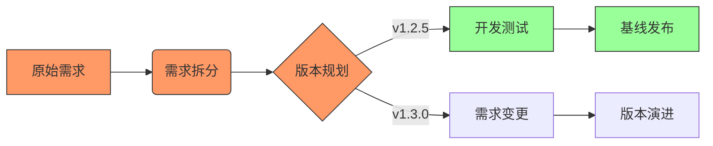

# AICO_项目管理规范

## 1. 文件结构
项目跟踪采用统一文件管理：
- `ProjectTracking.xlsx` （项目跟踪表）
  - **原始需求（Sheet1）**
  - **需求管理（Sheet2）**
  - **用户故事管理（Sheet3）**
  - **任务跟踪（Sheet4）**

## 2. `ProjectTracking.xlsx` 项目跟踪表

### 2.1 原始需求跟踪（Sheet:「原始需求」）
| 字段名称     | 字段含义                                                     |
|------------|----------------------------------------------------------|
| 需求文件     | 原始需求文件的路径,作为唯一标识                                |
| 需求类型     | 文档(md/txt/docx)/视频/音频/其他                            |
| 添加时间     | 需求文件添加到项目的时间                                      |
| 当前状态     | new(新建)/parsed_by_ba(BA已解析)/parsed_by_ea(EA已解析)/completed(完成) |
| 关联需求ID  | 关联到「需求管理」中的需求ID（格式: REQ-XXX）                 |
| BA解析时间   | BA角色完成需求解析的时间                                      |
| EA解析时间   | EA角色完成需求解析的时间                                      |
| 完成时间     | 需求解析完全完成的时间                                        |
| 备注        | 其他需要说明的信息                                           |

### 2.2 需求管理（Sheet:「需求管理」）
| 字段名称       | 字段含义                                                         |
|--------------|------------------------------------------------------------------|
| 需求ID       | 每条需求的唯一标识，用于关联用户故事和任务（格式: REQ-001）        |
| 原始需求文件 | 关联到「原始需求」中的需求文件路径                                |
| 需求名称     | 对需求的简短概括                                                 |
| 需求描述     | 详细描述需求内容，包括业务背景、功能逻辑等                        |
| 需求来源     | 需求的提出来源（客户反馈/内部优化/市场分析等）                     |
| 需求优先级   | 高/中/低 或 MoSCoW（Must/Should/Could/Won't）                     |
| 需求状态     | 需求状态（已提出/待评审/评审通过/开发中/完成/关闭）                |
| 提出人/负责人 | 该需求由谁提出，后续由谁负责跟进                                 |
| 提出时间     | 需求正式登记或提出的时间                                         |
| 目标完成时间 | 预计该需求完成的时间                                             |
| 验收标准     | 需求通过的标准，如输入、输出条件                                  |
| 设计状态     | 未开始/设计中/待评审/基线化                                      |
| 关联设计文档 | PRD文档路径（格式：`docs/design/prd/{版本}/xxx.md`）              |
| 代码基线版本 | 关联的代码版本号（格式：v1.0.0）                                  |
| 设计评审记录 | 评审人/评审时间/评审意见（JSON格式存储）                          |
| 备注         | 其他补充说明，例如风险、约束、依赖等                              |

---

### 2.3 用户故事管理（Sheet:「用户故事管理」）
| 字段名称      | 字段含义                                                   |
|-------------|----------------------------------------------------------|
| 用户故事ID  | 每个用户故事的唯一标识（格式: US-001）                     |
| 关联需求ID  | 该用户故事属于哪个需求（关联 `需求管理` 的 `需求ID`）       |
| 用户故事名称 | 用户故事的简要描述                                       |
| 用户故事描述 | 按照"As a ..., I want ..., so that ..." 方式描述用户需求 |
| 优先级      | 高/中/低，或与需求优先级一致                              |
| 状态        | 用户故事状态（待拆分/开发中/测试中/完成等）               |
| 验收标准    | 验收用户故事的客观标准，如输入、输出、业务规则           |
| 创建时间    | 该用户故事创建的时间                                     |
| 备注        | 其他需要说明的信息                                       |

---

### 2.4 任务跟踪（Sheet:「任务跟踪」）
| 字段名称         | 字段含义                                                   |
|-----------------|----------------------------------------------------------|
| 任务ID         | 每个任务的唯一标识（格式: T-001）                           |
| 关联需求ID     | 该任务属于哪个需求（关联 `需求管理` 的 `需求ID`）           |
| 关联用户故事ID | 该任务属于哪个用户故事（关联 `用户故事管理` 的 `用户故事ID`）|
| 任务名称       | 简要描述任务内容                                           |
| 任务描述       | 具体任务内容，包括实现方法、技术方案、业务规则等           |
| 任务类型       | 需求分析/架构设计/开发/测试/部署/文档编写                   |
| 关联产出物     | 关联的设计文档/测试用例/部署脚本路径                        |
| 负责人        | 该任务的执行者                                             |
| 任务状态      | 任务状态（待开始/进行中/已完成/阻塞等）                     |
| 计划开始时间  | 计划任务的开始时间                                         |
| 计划结束时间  | 计划任务的结束时间                                         |
| 实际开始时间  | 实际任务开始的时间                                         |
| 实际结束时间  | 实际任务完成的时间                                         |
| 备注         | 其他需要记录的信息，如风险、依赖等                         |

---


## 3. 关联逻辑更新
- **需求 (`REQ-XXX`) → 用户故事 (`US-XXX`) → 任务 (`T-XXX`)**  
  通过以下字段建立关联链：
  ```mermaid
  graph LR
    REQ[需求ID] --> US[用户故事ID]
    US --> TASK[任务ID]
  ```
  跟踪表中需保持以下关联：
  - 用户故事管理表的「关联需求ID」字段
  - 任务跟踪表的「关联用户故事ID」字段

## 4. 使用建议
1. **ID 命名规范**
   - 需求 ID： `REQ-001`
   - 用户故事 ID： `US-001`
   - 任务 ID： `T-001`
   - 这种命名方式有助于保持数据关联清晰。

2. **原始需求管理**
   - 原始需求文件统一存放在项目的 `raw_requirements` 目录下
   - 文件命名格式: `iter{迭代号}_{原始文件名}`
   - 每次迭代新增的需求都要在原始需求跟踪表中登记
   - BA/EA 解析完成后要及时更新状态和时间

3. **文件管理**
   - 推荐使用**云端存储**（如 Google Drive, OneDrive, SharePoint）共享文件，避免多人编辑冲突。
   - 原始需求文件要保持完整性，不要随意修改

4. **定期更新**
   - 需求变更时，及时同步 `原始需求`、`需求管理`、`用户故事管理` 和 `任务跟踪`。
   - 任务完成后，状态要同步更新到 `用户故事管理`，确保进度可追踪。


## 3.全流程跟踪示例（商品批次管理）

**原始需求跟踪（Sheet1）**
| 需求文件 | 类型 | 添加时间 | 当前状态 | 关联需求ID | BA解析时间 | EA解析时间 | 完成时间 | 版本基线 | 
|---------|------|----------|----------|------------|------------|------------|----------|----------|
| raw/iter3_batch.md | 文档 | 2024-06-01 | parsed_by_ea | REQ-004,005 | 2024-06-02 | 2024-06-03 | 2024-06-05 | v1.2.5/v1.3.0 |

**需求管理（Sheet2）**
| 需求ID | 原始需求 | 需求名称 | 优先级 | 状态 | 提出人 | 目标版本 | 设计状态 | 代码基线 | 验收标准 |
|--------|------------|----------|--------|------|--------|----------|----------|----------|----------|
| REQ-004 | iter3_batch | 批次属性管理 | 高 | 已完成 | 张经理 | v1.2.5 | 基线化 | v1.2.5 | 1.支持批次CRUD 2.字段校验 |
| REQ-005 | iter3_batch | 全流程追溯 | 中 | 开发中 | 王总监 | v1.3.0 | 设计中 | - | 1.正向追溯 2.逆向追溯 |

**用户故事管理（Sheet3）**
| 用户故事ID | 关联需求 | 用户故事描述 | 优先级 | 状态 | 创建时间 | 目标版本 | 验收标准 |
|------------|------------|--------------|--------|------|----------|----------|----------|
| US-004 | REQ-004 | 作为仓管员，我需要... | 高 | 完成 | 2024-06-05 | v1.2.5 | 可完成批次录入 |
| US-005 | REQ-005 | 作为质检员，我需要... | 中 | 开发中 | 2024-07-01 | v1.3.0 | 可查询完整追溯链 |

**任务跟踪（Sheet4）**
| 任务ID | 关联需求 | 用户故事 | 任务名称 | 类型 | 负责人 | 状态 | 计划时间 | 实际时间 | 产出物路径 |
|--------|------------|------------|----------|------|--------|------|----------|----------|------------|
| T-011 | REQ-004 | US-004 | 批次字段开发 | 开发 | 李工 | 完成 | 2024-06-10~12 | 2024-06-11~13 | /services/v1.2.5 |
| T-012 | REQ-005 | US-005 | 追溯接口设计 | 设计 | 王工 | 进行中 | 2024-07-05~07 | 2024-07-06~ | /design/v1.3.0 |


**版本推演**
```bash
# 版本v1.2.5（初始发布）目录结构
docs/
├── requirements/
│   ├── analyzed/
│   │   ├── v1.2.3/          # 历史版本保留
│   │   └── v1.2.5/          🔄 当前基线版本
│   │       └── REQ-004/
│   │           ├── biz_analysis.md
│   │           └── tech_analysis.md
└── design/
    ├── prd/
    │   ├── v1.2.3/          # 历史版本保留
    │   └── v1.2.5/          🔄 当前产品设计
    └── services/
        └── batch/
            ├── v1.2.3/      # 历史版本保留
            └── v1.2.5/      🔄 当前服务设计
                ├── service_design.md
                └── api_spec.yaml

# 版本v1.3.0（功能扩展）目录结构
docs/
├── requirements/
│   ├── analyzed/
│   │   ├── v1.2.5/          🔄 保留上一版本
│   │   └── v1.3.0/          🆕 新增需求分析
│   │       └── REQ-005/
│   │           ├── biz_analysis.md
│   │           └── tech_analysis.md
└── design/
    ├── prd/
    │   ├── v1.2.5/          🔄 保留旧版本
    │   └── v1.3.0/          🆕 新版产品设计
    └── services/
        ├── batch/
        │   ├── v1.2.5/      🔄 保留旧服务版本
        │   └── v1.3.0/      📝 服务升级版本
        │       └── batch_api_v2.yaml
        └── trace/
            └── v1.3.0/      🆕 新增追溯服务
                ├── trace_design.md
                └── trace_api.yaml

# 版本v1.2.6（紧急修复）目录结构
releases/
├── v1.2.5/                  🔄 保留历史发布包
└── v1.2.6/                  🆕 紧急修复版本
    ├── patch_notes.md       # 补丁说明
    ├── hotfix_batch_expiry.zip
    └── qa_report.md         📝 更新测试报告
```

**状态流转图**


